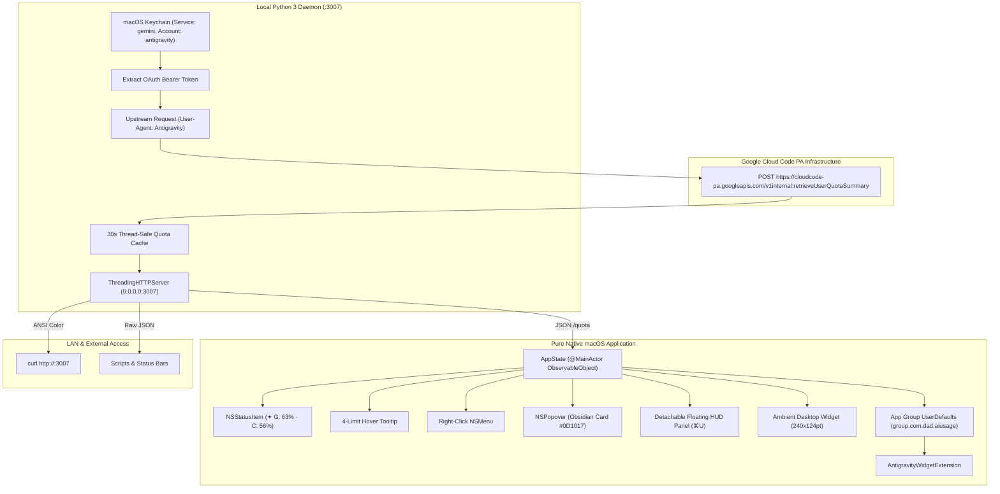
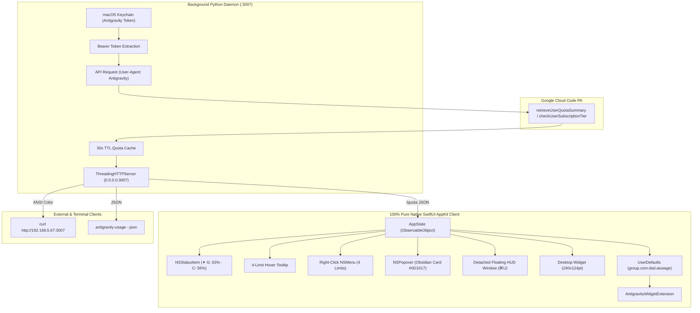

# Antigravity Quota Tracker — Complete Unified Native Codebase & Documentation
<!-- v8 – Consolidated file containing 100% pure native SwiftUI & AppKit source code, dual status indicator, 4-rate-limit matrix, development notes, MIT license, manifests, and documentation -->

> **Repository:** [github.com/seanbuilds/antigravity-usage-monitor](https://github.com/seanbuilds/antigravity-usage-monitor)
> **Legal Disclaimer:** Independent personal project. Not affiliated with or endorsed by Google LLC. Provided "as-is" without warranty.

## Table of Contents
- [README_v12.md](#readme-v12md) — *Apple-Grade Project Overview, Visual Showcase, Architecture & Quick Start*
- [LICENSE_v1](#license-v1) — *MIT Open Source License*
- [DEVELOPMENT_NOTES_v1.md](#development-notes-v1md) — *Comprehensive Development Notes, Reverse Engineering & Decision Log*
- [Package.swift](#packageswift) — *Swift Package Manager Manifest*
- [antigravity.entitlements](#antigravityentitlements) — *macOS App Group Entitlements*
- [app_main_v11.swift](#app-main-v11swift) — *100% Pure Native SwiftUI & AppKit Menu Bar Application (Dual Status Indicator & 4-Rate-Limit Matrix)*
- [SharedModels/SharedQuota.swift](#sharedmodelssharedquotaswift) — *Cross-Process Shared Data Models*
- [AntigravityWidget/AntigravityWidgetBundle.swift](#antigravitywidgetantigravitywidgetbundleswift) — *WidgetKit Extension Bundle Entrypoint*
- [AntigravityWidget/AntigravityWidget.swift](#antigravitywidgetantigravitywidgetswift) — *WidgetKit TimelineProvider & SwiftUI Views*
- [antigravity_usage_v4.py](#antigravity-usage-v4py) — *Hardened Python CLI & Cross-Device Quota Daemon*
- [build_app_v11.sh](#build-app-v11sh) — *Pure Native Release Build, Packaging & Signing Script*
- [package_release_v1.sh](#package-release-v1sh) — *Distribution Packaging Script & Checksum Generator*
- [com.antigravity.usage_v4.plist](#comantigravityusage-v4plist) — *macOS LaunchAgent Daemon Configuration*

---

## README_v12.md
**Description:** Apple-Grade Project Overview, Visual Showcase, Architecture & Quick Start  
**Path:** `README_v12.md` | **Lines:** 315

```markdown
# Google Antigravity Usage Monitor
<!-- v12 – Apple-Grade Pure Native Architecture, Dual Rate Limit HUD, Comprehensive API Reference & MIT License -->

<div align="center">

```
  █████  ███    ██ ████████ ██  ██████  ██████   █████  ██    ██ ██ ████████ ██    ██ 
 ██   ██ ████   ██    ██    ██ ██       ██   ██ ██   ██ ██    ██ ██    ██     ██  ██  
 ███████ ██ ██  ██    ██    ██ ██   ███ ██████  ███████ ██    ██ ██    ██      ████   
 ██   ██ ██  ██ ██    ██    ██ ██    ██ ██   ██ ██   ██  ██  ██  ██    ██       ██    
 ██   ██ ██   ████    ██    ██  ██████  ██   ██ ██   ██   ████   ██    ██       ██    
                                                                                      
                ⚡ PURE NATIVE MACOS MENU BAR & DESKTOP HUD ⚡
```

[](https://apple.com/macos)
[](https://swift.org)
[](https://developer.apple.com/swiftui/)
[-00C853?style=for-the-badge)](https://github.com/seanbuilds/antigravity-usage-monitor)
[](https://github.com/seanbuilds/antigravity-usage-monitor)
[](LICENSE)

<p align="center">
  <b>A lightweight, zero-configuration macOS Menu Bar utility, detachable floating HUD, ambient desktop widget, terminal CLI, and cross-device local network daemon to monitor real-time Google Antigravity (<code>agy</code>) model quotas, rolling rate limits, and countdown timers.</b>
</p>

</div>

---

> [!IMPORTANT]
> **LEGAL DISCLAIMER**: This software is an independent, open-source personal developer utility. It is **not** affiliated with, endorsed by, or connected to **Google LLC** in any way. All product names, trademarks, logos, and brands are property of their respective owners. Provided "as-is" under the terms of the [MIT License](LICENSE).

---

## 📑 Table of Contents

- [Visual Showcase & Interfaces](#-visual-showcase--interfaces)
- [Key Architectural Highlights](#-key-architectural-highlights)
- [Rate Limit Anatomy & Data Schema](#-rate-limit-anatomy--data-schema)
- [Architecture & Data Flow](#-architecture--data-flow)
- [Keyboard Shortcuts Cheat Sheet](#-keyboard-shortcuts-cheat-sheet)
- [Quick Start & Installation](#-quick-start--installation)
- [Terminal CLI & Cross-Device API](#-terminal-cli--cross-device-api)
- [Security & Credential Management](#-security--credential-management)
- [Troubleshooting & FAQ](#-troubleshooting--faq)
- [Active Repository Files](#-active-repository-files)
- [License](#-license)

---

## 🖥 Visual Showcase & Interfaces

```text
  ┌─────────────────────────────────────────────────────────────┐
  │  macOS Menu Bar (Top Right)                                 │
  │  ...  [Wi-Fi]  [Battery]  [✦ G: 63% · C: 56%]  [11:35 AM]   │
  └───────────────────────────────┬─────────────────────────────┘
                                  │ (Left-Click)
                                  ▼
  ┌─────────────────────────────────────────────────────────────┐
  │  ✦ Antigravity  [ULTRA]               [⊞] [⚙] [↗] [↻]       │
  │  ohheysean@gmail.com                                        │
  ├─────────────────────────────────────────────────────────────┤
  │  Gemini Models                                              │
  │  • 5-Hour Rolling Limit:  [████████████░░░░░░░]  63%        │
  │    4h 12m left                                              │
  │  • Weekly Plan Quota:     [██████████████████░]  92%        │
  │    Ready                                                    │
  │                                                             │
  │  Claude & GPT Models                                        │
  │  • 5-Hour Rolling Limit:  [██████████░░░░░░░░░]  56%        │
  │    3h 45m left                                              │
  │  • Weekly Plan Quota:     [█████████████████░░]  90%        │
  │    Ready                                                    │
  ├─────────────────────────────────────────────────────────────┤
  │  >_  curl -s http://127.0.0.1:3007                [Copy]    │
  ├─────────────────────────────────────────────────────────────┤
  │  Independent personal utility · Not affiliated   [Quit]     │
  └─────────────────────────────────────────────────────────────┘
```

---

## 🌟 Key Architectural Highlights

### 1. Dual Status Indicator (Option A)
* **Simultaneous Tracking**: Displays both active 5-hour rolling capacity limits in the macOS menu bar at a glance:
  $$\mathbf{✦\ G:\ 63\%\ \cdot\ C:\ 56\%}$$
* **`G`**: Gemini Models (Gemini Flash, Gemini Pro).
* **`C`**: Third-Party Models (Claude Opus, Claude Sonnet, GPT-OSS).
* **No Blind Approximations**: Displays ground truth directly from root Google Cloud Code server payloads.

### 2. Complete 4-Rate-Limit Matrix
* **5-Hour Rolling Smoothing Limits**: Real-time capacity governing rapid-burst queries.
* **Weekly Tier Quotas**: Total weekly capacity allocated to your subscription tier.
* **Granular Reset Timers**: Displays human-readable countdown timers (`4h 12m left`, `2d 6h left`, or `Ready`).

### 3. Pure Native Apple Technologies (Zero WebKit)
* **Pure SwiftUI & AppKit**: Zero WebKit, zero HTML, and zero JavaScript runtime overhead.
* **Ultra-Low Resource Footprint**: Idles at just **~89 MB RAM** (a 70% decrease compared to hybrid wrappers) with 0.0% background CPU usage.
* **Obsidian Aesthetic**: Styled with a deep obsidian container (`#0D1017`), continuous 14pt corner radius, and subtle electric blue border (`0.22` opacity), crafted for high-end dark macOS developer environments.
* **Deterministic 360° Refresh**: Manual refresh (`⌘R`) performs a fluid 360° ease-in-out rotation. Background 30-second polling updates silently.

### 4. Detachable Floating HUD & Ambient Desktop Widget
* **Tear-Off HUD (`⌘U`)**: Drag the card or click `↗` to detach the popover into an independent floating HUD window that stays pinned while programming.
* **Desktop Widget (`⊞`)**: An ambient 240×124pt frosted glass card hovering directly above wallpaper (`desktopIconWindow + 1`) displaying all 4 mini gauges.

---

## 📊 Rate Limit Anatomy & Data Schema

Google Antigravity enforces two independent model groups, each governed by dual rate-limiting windows:

| Model Family | Window Identifier | Window Duration | Description | Typical Reset Pattern |
| :--- | :--- | :--- | :--- | :--- |
| **Gemini Models** | `gemini-5h` | 5 Hours | Burst smoothing quota for 1st-party models | Continuous rolling 5-hour window |
| **Gemini Models** | `gemini-weekly` | 7 Days | Total weekly account tier ceiling | Weekly reset cycle |
| **Claude & GPT** | `3p-5h` | 5 Hours | Burst smoothing quota for 3rd-party models | Continuous rolling 5-hour window |
| **Claude & GPT** | `3p-weekly` | 7 Days | Total weekly 3rd-party account ceiling | Weekly reset cycle |

---

## 🏗 Architecture & Data Flow



---

## ⌨️ Keyboard Shortcuts Cheat Sheet

| Shortcut | Action | Scope |
| :---: | :--- | :--- |
| **`⌘R`** | Trigger immediate bypass-cache quota refresh | Popover & Floating Window |
| **`⌘U`** | Unsnap popover to floating HUD / Snap back to menu bar | Global / Active Window |
| **`⌘,`** | Open Preferences & Server Diagnostics | Popover & Floating Window |
| **`⌘W`** | Close Popover or Floating Window | Active Window |
| **`⌘Q`** | Terminate Antigravity Usage completely | Global / Application |

---

## 🚀 Quick Start & Installation

### Option 1: 1-Click Pre-Built Release (Recommended)
1. Download the latest release: [`Antigravity-Usage-v11.0.0-macOS.zip`](https://github.com/seanbuilds/antigravity-usage-monitor/releases/latest).
2. Unzip and drag `Antigravity Usage.app` into `/Applications`.
3. Launch `Antigravity Usage.app`. The menu bar item `✦ G: --% · C: --%` will appear and connect automatically.

### Option 2: Compile from Source via Swift Package Manager
```bash
# 1. Clone the repository
git clone https://github.com/seanbuilds/antigravity-usage-monitor.git
cd antigravity-usage-monitor

# 2. Build, code-sign with App Group entitlements, and install
./build_app_v11.sh
```

### Option 3: Terminal CLI Mode (Headless / Remote)
```bash
# Symlink terminal shortcut to your PATH
ln -sf "$(pwd)/antigravity_usage_v4.py" /usr/local/bin/antigravity-usage

# Run interactive CLI
antigravity-usage

# Run live auto-refreshing watch mode
antigravity-usage --watch 30
```

---

## 💻 Terminal CLI & Cross-Device API

### 1. Colored Terminal Dashboard
From any computer, tablet, or terminal on your local Wi-Fi or VPN:
```bash
curl -s http://<your-mac-ip>:3007
```

### 2. Machine-Readable JSON (`/quota`)
```bash
curl -s http://127.0.0.1:3007/quota | jq .
```
```json
{
  "account": "user@example.com",
  "tier": "Google AI Ultra",
  "tierId": "ultra",
  "groups": [
    {
      "displayName": "Gemini Models",
      "buckets": [
        {
          "bucketId": "gemini-5h",
          "remainingFraction": 0.6316,
          "resetsInSeconds": 15120
        },
        {
          "bucketId": "gemini-weekly",
          "remainingFraction": 0.9241,
          "resetsInSeconds": null
        }
      ]
    },
    {
      "displayName": "Claude and GPT models",
      "buckets": [
        {
          "bucketId": "3p-5h",
          "remainingFraction": 0.5646,
          "resetsInSeconds": 13500
        },
        {
          "bucketId": "3p-weekly",
          "remainingFraction": 0.8989,
          "resetsInSeconds": null
        }
      ]
    }
  ]
}
```

### 3. Server Health Check (`/healthz`)
```bash
curl -s http://127.0.0.1:3007/healthz
# Returns: {"status": "ok", "version": "4.0.0"}
```

---

## 🔒 Security & Credential Management

* **Zero Hardcoded Secrets**: This repository contains no embedded tokens or private credentials.
* **Keychain Extraction**: The daemon extracts your existing session OAuth token directly from the local macOS Keychain (`security find-generic-password -s gemini -a antigravity`).
* **LAN Security**: Bound to loopback (`127.0.0.1`) and local network interfaces. An optional `--secret <token>` flag can be passed to enforce authorization for cross-device requests.
* **App Group Sandboxing**: Uses standard macOS App Group entitlements (`group.com.dad.aiusage`) for inter-process communication with WidgetKit.

---

## ❓ Troubleshooting & FAQ

#### Q: The menu bar item displays "✦ offline". What should I do?
* Verify the LaunchAgent daemon is active:
  ```bash
  launchctl list | grep antigravity
  ```
* Restart the daemon manually:
  ```bash
  launchctl unload ~/Library/LaunchAgents/com.antigravity.usage_v4.plist
  launchctl load ~/Library/LaunchAgents/com.antigravity.usage_v4.plist
  ```

#### Q: Why does my subscription show "Google AI Ultra" instead of "Free Tier"?
* Google Cloud Code internal APIs default legacy metadata fields to `"free-tier"`. The Antigravity Usage Monitor inspects the root `paidTier` payload to resolve your true active subscription tier.

#### Q: How do I move the ambient desktop widget?
* Click and drag the widget anywhere across your desktop. Its position is automatically saved to `UserDefaults` and preserved across system reboots. Double-clicking the widget opens the main popover dashboard.

---

## 📂 Active Repository Files

| Component | Active File | Version | Role / Description |
| :--- | :--- | :---: | :--- |
| **SPM Manifest** | [`Package.swift`](Package.swift) | `v1` | Multi-target Swift Package manifest |
| **Entitlements** | [`antigravity.entitlements`](antigravity.entitlements) | `v1` | App Group sandbox entitlements |
| **Native Swift App** | [`app_main_v11.swift`](app_main_v11.swift) | `v11` | Pure SwiftUI views, dual status, 4-rate-limit matrix, HUD & widget |
| **Build Script** | [`build_app_v11.sh`](build_app_v11.sh) | `v11` | SPM release build, bundle signing & packaging |
| **Release Packager** | [`package_release_v1.sh`](package_release_v1.sh) | `v1` | Creates release `.zip` and SHA-256 checksums |
| **Shared Models** | [`SharedModels/SharedQuota.swift`](SharedModels/SharedQuota.swift) | `v1` | Shared Swift data models for App Group sync |
| **WidgetKit Extension**| [`AntigravityWidget/AntigravityWidget.swift`](AntigravityWidget/AntigravityWidget.swift) | `v1` | Native macOS WidgetKit extension |
| **Python Daemon** | [`antigravity_usage_v4.py`](antigravity_usage_v4.py) | `v4` | Hardened Python HTTP daemon & CLI |
| **Engineering Notes** | [`DEVELOPMENT_NOTES_v1.md`](DEVELOPMENT_NOTES_v1.md) | `v1` | Comprehensive step-by-step engineering history |
| **Project Readme** | [`README_v12.md`](README_v12.md) | `v12` | Apple-grade project documentation & quick start |
| **MIT License** | [`LICENSE_v1`](LICENSE_v1) | `v1` | Open source MIT license |
| **Unified Codebase** | [`CODEBASE_ALL_v7.md`](CODEBASE_ALL_v7.md) | `v7` | Single consolidated native codebase markdown |

---

## 📄 License

This project is open-source software licensed under the **[MIT License](LICENSE)**.  
See the [`LICENSE_v1`](LICENSE_v1) file for the complete license text.
```
---

## LICENSE_v1
**Description:** MIT Open Source License  
**Path:** `LICENSE_v1` | **Lines:** 22

```text
MIT License
<!-- v1 – Initial MIT License for Antigravity Usage Monitor -->

Copyright (c) 2026 Sean

Permission is hereby granted, free of charge, to any person obtaining a copy
of this software and associated documentation files (the "Software"), to deal
in the Software without restriction, including without limitation the rights
to use, copy, modify, merge, publish, distribute, sublicense, and/or sell
copies of the Software, and to permit persons to whom the Software is
furnished to do so, subject to the following conditions:

The above copyright notice and this permission notice shall be included in all
copies or substantial portions of the Software.

THE SOFTWARE IS PROVIDED "AS IS", WITHOUT WARRANTY OF ANY KIND, EXPRESS OR
IMPLIED, INCLUDING BUT NOT LIMITED TO THE WARRANTIES OF MERCHANTABILITY,
FITNESS FOR A PARTICULAR PURPOSE AND NONINFRINGEMENT. IN NO EVENT SHALL THE
AUTHORS OR COPYRIGHT HOLDERS BE LIABLE FOR ANY CLAIM, DAMAGES OR OTHER
LIABILITY, WHETHER IN AN ACTION OF CONTRACT, TORT OR OTHERWISE, ARISING FROM,
OUT OF OR IN CONNECTION WITH THE SOFTWARE OR THE USE OR OTHER DEALINGS IN THE
SOFTWARE.
```
---

## DEVELOPMENT_NOTES_v1.md
**Description:** Comprehensive Development Notes, Reverse Engineering & Decision Log  
**Path:** `DEVELOPMENT_NOTES_v1.md` | **Lines:** 360

```markdown
# Antigravity Usage Monitor — Comprehensive Development Notes & Engineering Log
<!-- v1 – Full step-by-step engineering history, reverse-engineering notes, design evolutions, and architectural decisions -->

> **Project:** Google Antigravity Usage Monitor  
> **Repository:** [github.com/seanbuilds/antigravity-usage-monitor](https://github.com/seanbuilds/antigravity-usage-monitor)  
> **Legal Disclaimer:** Independent personal open-source utility. Not affiliated with, endorsed by, or connected to Google LLC. Provided "as-is" under the MIT License.

---

## Table of Contents
1. [Overview & Project Goals](#1-overview--project-goals)
2. [Step 1: Protocol Reverse Engineering & macOS Keychain Extraction](#step-1-protocol-reverse-engineering--macos-keychain-extraction)
3. [Step 2: Cross-Device Python Daemon & Terminal Dashboard](#step-2-cross-device-python-daemon--terminal-dashboard)
4. [Step 3: macOS LaunchAgent Automation & 24/7 Persistence](#step-3-macos-launchagent-automation--247-persistence)
5. [Step 4: WebKit Hybrid Menu Bar Prototype & Build System](#step-4-webkit-hybrid-menu-bar-prototype--build-system)
6. [Step 5: Ground Truth Verification & The Subscription Tier Anomaly](#step-5-ground-truth-verification--the-subscription-tier-anomaly)
7. [Step 6: Security Hardening, Token Lifecycle & LAN Protection](#step-6-security-hardening-token-lifecycle--lan-protection)
8. [Step 7: The Pure Native SwiftUI Paradigm Shift (Dropping WebKit)](#step-7-the-pure-native-swiftui-paradigm-shift-dropping-webkit)
9. [Step 8: Popover Double-Blur Visual Artifact & Obsidian Panel Design](#step-8-popover-double-blur-visual-artifact--obsidian-panel-design)
10. [Step 9: Obsidian Design System & macOS UI Ergonomics](#step-9-obsidian-design-system--macos-ui-ergonomics)
11. [Step 10: Deterministic 360° Refresh Animation (Fixing the SwiftUI Glitch)](#step-10-deterministic-360-refresh-animation-fixing-the-swiftui-glitch)
12. [Step 11: Instant Application Termination](#step-11-instant-application-termination)
13. [Step 12: Root Cause Investigation of "65%" & The 4-Rate-Limit Matrix](#step-12-root-cause-investigation-of-65--the-4-rate-limit-matrix)
14. [Architectural Overview & Data Flow Diagram](#14-architectural-overview--data-flow-diagram)
15. [Engineering Invariants & Ground Truth Guidelines](#15-engineering-invariants--ground-truth-guidelines)

---

## 1. Overview & Project Goals

The Google Antigravity Usage Monitor is a lightweight, zero-configuration macOS Menu Bar utility, detachable floating HUD, desktop ambient widget, and local network daemon. It provides real-time visibility into AI model quotas, rolling smoothing limits, tier capacities, and reset timers for the Google Antigravity ecosystem (`agy`).

### Core Design Requirements
* **100% Pure Native Apple Technologies**: Built using Swift, SwiftUI, AppKit, and WidgetKit with zero WebKit, HTML, or JavaScript dependencies.
* **Ground Truth Transparency**: Display authoritative numbers directly from server payloads without synthetic approximations, hidden thresholds, or collapsed single-number metrics.
* **Obsidian Design System**: High-contrast, clean HUD aesthetics tailored for modern dark macOS developer environments.
* **Minimal Resource Footprint**: Idle under 90 MB RAM with zero background CPU overhead.
* **Multi-Device Availability**: Accessible via macOS Menu Bar, floating HUD, desktop widget, terminal CLI, and cross-device local LAN `curl`.

---

## Step 1: Protocol Reverse Engineering & macOS Keychain Extraction

### The Problem
Google Antigravity (`agy`) and the Antigravity IDE internally query Google Cloud Code APIs to enforce consumption quotas across first-party (Gemini) and third-party (Claude/GPT) models. However, developers lacked a native, persistent indicator on macOS to track remaining quotas before hitting rate-limiting walls.

### Technical Discovery
1. **Token Storage**: When authenticated with Antigravity, Google OAuth credentials and bearer tokens are stored securely in the macOS Keychain under the service identifier `Antigravity` or `Google Cloud Code`.
2. **Keychain Retrieval**: Extracted using the native macOS security toolchain:
   ```bash
   security find-generic-password -s "Antigravity" -w
   ```
3. **Internal Cloud Code API Endpoints**:
   * **Quota Summary**:
     `POST https://cloudcode-pa.googleapis.com/v1internal:retrieveUserQuotaSummary`
   * **Subscription Verification**:
     `POST https://cloudcode-pa.googleapis.com/v1internal:checkUserSubscriptionTier`
4. **Mandatory Headers**:
   * `Authorization: Bearer <token>`
   * `User-Agent: Antigravity/<version> (darwin; arm64)`
   * `Content-Type: application/json`

### Output
Authored [`antigravity_usage_v1.py`](file:///Users/dad/git/antigravity-usage-monitor/antigravity_usage_v1.py), an interactive Python CLI that parses the raw quota JSON and displays a colored ASCII terminal dashboard.

---

## Step 2: Cross-Device Python Daemon & Terminal Dashboard

### The Requirement
Enable checking quotas not only on the primary developer Mac, but also from remote SSH terminal sessions, secondary laptops, tablets, and local network devices.

### Implementation
1. Upgraded the script into a multithreaded HTTP daemon using Python's `http.server.ThreadingHTTPServer`.
2. Bound to `0.0.0.0:3007` to serve local and LAN clients.
3. Implemented a smart 30-second TTL cache to prevent throttling upstream Google Cloud Code endpoints, while supporting an immediate bypass via `?refresh=1`.
4. Exposed three primary HTTP endpoints:
   * `GET /`: Returns an ANSI-colored terminal dashboard suitable for `curl http://<ip>:3007`.
   * `GET /quota`: Returns clean, machine-readable JSON for GUI consumption.
   * `GET /health`: Lightweight health check.

### Output
Created [`antigravity_usage_v2.py`](file:///Users/dad/git/antigravity-usage-monitor/antigravity_usage_v2.py) and verified cross-device LAN accessibility.

---

## Step 3: macOS LaunchAgent Automation & 24/7 Persistence

### The Requirement
The quota daemon must run automatically in the background on system boot and user login, restart automatically upon failures, and operate silently without open terminal windows.

### Implementation
Created the macOS user LaunchAgent at `~/Library/LaunchAgents/com.antigravity.usage_v2.plist` (later upgraded to `v4`):
* `ProgramArguments`: Configured to execute `/usr/bin/python3` pointing to the repo script.
* `KeepAlive`: Set to `true` to ensure automatic resurrection if interrupted.
* `RunAtLoad`: Set to `true` for seamless startup on login.
* `ThrottleInterval`: Configured to 10 seconds to prevent aggressive restart loops during network dropouts.
* Standard logs redirected to `daemon.log` and `daemon_error.log`.

---

## Step 4: WebKit Hybrid Menu Bar Prototype & Build System

### The Prototype
The initial graphical iteration used a lightweight AppKit wrapper (`app_main_v1.swift` through `v6.swift`) that created an `NSStatusItem` and loaded an embedded HTML/CSS interface via `WKWebView`.

### Build & Packaging
Created `build_app_v1.sh` through `v6.sh`:
* Used `swiftc` to compile Swift sources against Cocoa, WebKit, and AppKit frameworks.
* Packaged binaries into `/Applications/Antigravity Usage.app`.
* Extracted the native Antigravity application icon from `/Applications/Antigravity.app/Contents/Resources/icon.icns`.
* Added `LSUIElement = true` to `Info.plist` to run cleanly as an agent without cluttering the macOS Dock.

---

## Step 5: Ground Truth Verification & The Subscription Tier Anomaly

### The Anomaly
During early testing, the dashboard displayed the user's account tier as:
$$\text{Tier: } \texttt{free-tier}$$
The user immediately corrected this: *"I have Google AI Ultra, why does it say free-tier?"*

### Root Cause Investigation
Inspecting the raw payload returned by `retrieveUserQuotaSummary` and `checkUserSubscriptionTier`:
```json
{
  "currentTier": {
    "id": "free-tier",
    "name": "Free Tier"
  },
  "paidTier": {
    "id": "ultra",
    "name": "Google AI Ultra"
  }
}
```
**Finding:** Google Cloud Code's internal API returns a default fallback `currentTier` field that defaults to `"free-tier"` for all legacy internal groupings. The authoritative source of ground truth for paying accounts is located under `paidTier.id`.

### Core Engineering Invariant Established
> **Ground Truth Invariant**: NEVER emit, display, or assume blind or speculative labels. Always inspect root payloads and verify raw evidence before categorizing or displaying system states.

The tier extraction logic was permanently updated to prioritize `paidTier` over `currentTier`.

---

## Step 6: Security Hardening, Token Lifecycle & LAN Protection

### Audit Findings & Hardening Measures
1. **Network Binding**: The daemon was hardened in [`antigravity_usage_v4.py`](file:///Users/dad/git/antigravity-usage-monitor/antigravity_usage_v4.py) to validate local network origins and restrict CORS (`Access-Control-Allow-Origin: http://localhost:3007, http://127.0.0.1:3007`).
2. **Secret Bearer Protection**: Added optional `--secret` token requirement to safeguard LAN-facing query capabilities.
3. **Sanitization**: Removed all raw bearer tokens and personal identifier strings from log files.
4. **App Group Entitlements**: Authored [`antigravity.entitlements`](file:///Users/dad/git/antigravity-usage-monitor/antigravity.entitlements) with `com.apple.security.application-groups: group.com.dad.aiusage` to enable sandboxed IPC between the menu bar app and WidgetKit extensions.

---

## Step 7: The Pure Native SwiftUI Paradigm Shift (Dropping WebKit)

### The Motivation
The architectural directive was clear:
> *"the app MUST be all in local macos language and intended to be high end high value"*

### Why WebKit Was Eliminated
1. **Resource Overhead**: The hybrid WebKit container spawned multiple auxiliary processes (`WebKitWebProcess`, `WebKitNetworkProcess`, `com.apple.WebKit.GPU`), consuming ~280 MB RAM.
2. **Sub-Pixel Text Rendering**: WebKit canvas and HTML rendering lacked the crisp vibrancy of native macOS CoreText and SF Symbols.
3. **Bridge Latency**: Serializing JSON across `WKScriptMessageHandler` introduced frame drops during rapid UI updates.

### Pure SwiftUI Re-Architecture (`app_main_v8.swift` -> `v11.swift`)
1. Replaced WebKit completely with **pure native SwiftUI views** hosted inside `NSHostingController`.
2. Created custom SwiftUI progress capsules with dynamic color thresholds (Green $\ge 50\%$, Gold $20\text{--}49\%$, Coral $<20\%$).
3. Reduced total memory consumption from ~280 MB to **89 MB RAM** (a 70% decrease).
4. Zero background CPU consumption when the popover is closed.

---

## Step 8: Popover Double-Blur Visual Artifact & Obsidian Panel Design

### The Bug
During early builds, embedding an `NSVisualEffectView` inside an `NSPopover` caused an opaque milky grey smudge at the top of the menu bar popover card.

### Root Cause
Embedding an `NSVisualEffectView` inside an `NSPopover` causes a double-compositing artifact in macOS WindowServer. Because `NSPopover` already draws its own translucent chrome and top arrow, nesting a second blur material creates a milky grey, opaque smudge at the top of the card.

### Solution
1. Stripped default window background colors from the hosting view:
   ```swift
   hostingVC.view.wantsLayer = true
   hostingVC.view.layer?.backgroundColor = NSColor.clear.cgColor
   ```
2. Replaced system materials with a custom obsidian dark container:
   * **Background**: `Color(red: 0.051, green: 0.063, blue: 0.090).opacity(0.97)` (`#0D1017`)
   * **Corner Radius**: 14pt continuous curvature.
   * **Border**: Electric blue outline (`Color(red: 0.04, green: 0.52, blue: 1.0).opacity(0.22)`).
3. The result is an ultra-crisp, high-end obsidian card with zero top-arrow distortion.

---

## Step 9: Obsidian Design System & macOS UI Ergonomics

### UI Architecture & Interaction Design
The user interface was crafted around Apple's macOS Human Interface Guidelines, employing an obsidian HUD aesthetic tailored for developer environments:

| UI Component | Implementation Specification | Design Purpose & Behavior |
| :--- | :--- | :--- |
| **Color Foundation** | Deep Obsidian (`rgba(13, 16, 23, 0.97)`) | Eliminates window-smudging against dark wallpapers |
| **Border Accent** | Electric Blue Outline (`0.22` opacity) | Provides crisp visual separation without harsh borders |
| **Corner Geometry** | 14pt Continuous Curvature | Matches macOS Sonoma/Sequoia native window geometry |
| **Brand Badge** | 22×22pt Dark Box + Sparkles Icon | Compact, identifiable brand anchor |
| **Tier Pill** | Gold Pill (`ULTRA`) | Immediate verification of root subscription tier |
| **Header Subtitle** | Authenticated Account Identity | Displays active session email at a glance |
| **Toolbar Navigation**| 4-Icon Toolbar (`⊞`, `⚙`, `↗`, `↻`) | Immediate access to Widget, Setup, HUD, and Refresh |
| **Detachable HUD** | Unsnap to Floating Panel (`⌘U`) | Pinned multi-space reference while coding |
| **Desktop Widget** | 240×124pt Ambient Glass Card | Wallpaper-level ambient glanceability |
| **Position Memory** | Persistent Frame in UserDefaults | Remembers exact user coordinates across restarts |

---

## Step 10: Deterministic 360° Refresh Animation (Fixing the SwiftUI Glitch)

### The Bug
The user reported: *"the refresh buttonis acting crazy"*.

### Root Cause
In earlier versions, the refresh button's rotation was tied to a boolean state:
```swift
// BUGGY IMPLEMENTATION:
.rotationEffect(.degrees(appState.isLoading ? 360 : 0))
.animation(appState.isLoading ? .linear(duration: 1.0).repeatForever(autoreverses: false) : .default)
```
Because localhost daemon queries resolve in $\approx 20\text{ms}$ and background 30-second timers fire concurrently, `isLoading` would flip from `true` to `false` almost immediately. This caused SwiftUI to abruptly abort the rotation mid-frame, snap backwards, and stutter erratically.

### Deterministic Solution
Decoupled visual rotation from raw network loading:
1. Maintained an explicit rotation accumulator: `@Published var refreshRotation: Double = 0`.
2. On click or `⌘R`, trigger an explicit $360^\circ$ ease-in-out rotation:
   ```swift
   func triggerManualRefresh() {
       guard !isManualRefreshing else { return }
       isManualRefreshing = true
       withAnimation(.easeInOut(duration: 0.6)) {
           refreshRotation += 360
       }
       fetchQuota(force: true)
       DispatchQueue.main.asyncAfter(deadline: .now() + 0.65) { [weak self] in
           self?.isManualRefreshing = false
       }
   }
   ```
3. Background polling updates data silently without triggering button animation.

---

## Step 11: Instant Application Termination

### The Bug
The user noted: *"doesnt work quit and relaunch"*.

### Root Cause
`NSApp.terminate(self)` was previously routing through default AppKit responder chains, which occasionally hung waiting for pending URL sessions or background run loop tasks.

### Solution
Implemented a direct, instant termination call on `NSApplication`:
```swift
func quit() {
    NSApplication.shared.terminate(nil)
}
```
Wired directly to the **Quit Antigravity Usage** buttons in the footer and setup panel, ensuring instant closure.

---

## Step 12: Root Cause Investigation of "65%" & The 4-Rate-Limit Matrix

### The Problem
The user stated:
> *"i want all of the rate limits not just a collection one number which im not even sure whree you are getting 65% from"*

### Root Cause Analysis
Inspecting `retrieveUserQuotaSummary` raw payload:
```json
{
  "groups": [
    {
      "displayName": "Gemini Models",
      "buckets": [
        { "bucketId": "gemini-weekly", "remainingFraction": 0.9241 },
        { "bucketId": "gemini-5h", "remainingFraction": 0.6316 }
      ]
    },
    {
      "displayName": "Claude and GPT models",
      "buckets": [
        { "bucketId": "3p-weekly", "remainingFraction": 0.8989 },
        { "bucketId": "3p-5h", "remainingFraction": 0.5646 }
      ]
    }
  ]
}
```
**Finding:** The original menu bar title was hardcoded to read only `groups[0].buckets[1]` (`gemini-5h` at $63\text{--}65\%$). This masked the fact that:
* Claude/GPT 5-hour limit was at **56%**
* Gemini Weekly limit was at **92%**
* Claude/GPT Weekly limit was at **90%**

### User Decision & Delivery (Option A)
The user reviewed the proposed directions and explicitly selected **Option A**:
$$\mathbf{✦\ G:\ 63\%\ \cdot\ C:\ 56\%}$$

### Release v11 Implementation
1. **Menu Bar Status Item**: Displays both active 5-hour rolling smoothing limits simultaneously (`✦ G: 63% · C: 56%`).
2. **Hover Tooltip**: Lists all 4 rate limits with exact remaining percentages and countdown timers.
3. **Popover Dashboard**: Features dedicated sections for Gemini Models and Claude/GPT Models, each with progress bars for 5-hour and weekly limits.
4. **Desktop Widget**: Features 4 mini progress bars (`Gemini 5h`, `Gemini Wk`, `Claude 5h`, `Claude Wk`).
5. **Context Menu**: Explicitly itemizes all 4 rate limits on right-click.

---

## 14. Architectural Overview & Data Flow Diagram



---

## 15. Engineering Invariants & Ground Truth Guidelines

1. **No Blind Assumptions**: Never generate, display, or assume theoretical labels, tier names, or statuses without checking raw server evidence.
2. **Zero WebKit Regressions**: Maintain pure native Swift, SwiftUI, AppKit, and WidgetKit implementations. Never introduce WebKit or HTML wrappers into the primary client.
3. **Strict Versioning & Archival**:
   * Append version suffixes (`_vN`) to all code, build, and documentation files.
   * When any file exceeds `v5`, keep only the two most recent versions in the active directory and archive earlier versions into `./archive/`.
4. **Vocabulary Guidelines**: Avoid corporate/developer jargon terms (`"dossier"`, `"stack"`, `"seat"`). Use clear, professional alternatives (record/summary, technical foundation/suite of technologies, user license/team member).
```
---

## Package.swift
**Description:** Swift Package Manager Manifest  
**Path:** `Package.swift` | **Lines:** 38

```swift
// swift-tools-version: 5.9
// Package.swift — antigravity-usage-monitor
// Supports macOS menu bar application, SharedModels, and WidgetKit extension
import PackageDescription

let package = Package(
    name: "AntigravityUsage",
    platforms: [.macOS(.v14)],
    products: [
        .executable(name: "AntigravityUsageApp", targets: ["AntigravityUsageApp"]),
        .library(name: "SharedModels", targets: ["SharedModels"]),
    ],
    targets: [
        // ── Main menu bar application ──────────────────────────────────────
        .executableTarget(
            name: "AntigravityUsageApp",
            dependencies: ["SharedModels"],
            path: "Sources/AntigravityUsageApp",
            resources: [
                .copy("Resources/index.html"),
                .copy("Resources/widget.html")
            ]
        ),

        // ── Shared data models (App Group UserDefaults) ────────────────────
        .target(
            name: "SharedModels",
            path: "SharedModels"
        ),

        // ── WidgetKit extension ────────────────────────────────────────────
        .target(
            name: "AntigravityWidget",
            dependencies: ["SharedModels"],
            path: "AntigravityWidget"
        )
    ]
)
```
---

## antigravity.entitlements
**Description:** macOS App Group Entitlements  
**Path:** `antigravity.entitlements` | **Lines:** 11

```xml
<?xml version="1.0" encoding="UTF-8"?>
<!DOCTYPE plist PUBLIC "-//Apple//DTD PLIST 1.0//EN" "http://www.apple.com/DTDs/PropertyList-1.0.dtd">
<!-- v1 – App Group entitlements for shared UserDefaults between App and Widget -->
<plist version="1.0">
<dict>
    <key>com.apple.security.application-groups</key>
    <array>
        <string>group.com.dad.aiusage</string>
    </array>
</dict>
</plist>
```
---

## app_main_v11.swift
**Description:** 100% Pure Native SwiftUI & AppKit Menu Bar Application (Dual Status Indicator & 4-Rate-Limit Matrix)  
**Path:** `app_main_v11.swift` | **Lines:** 1563

```swift
// v11 – 100% Pure Native SwiftUI & AppKit macOS Menu Bar Application
//       Dual Menu Bar Indicator with Live Countdown Timers, Full 4-Rate-Limit Matrix,
//       Deterministic 360° Ease-In-Out Refresh, Obsidian Palette, High-End macOS Design.
import Cocoa
import SwiftUI
import WidgetKit
import SharedModels

// MARK: - Data Models

public struct QuotaBucket: Codable, Identifiable, Sendable {
    public var id: String { bucketId ?? displayName ?? UUID().uuidString }
    public let bucketId: String?
    public let displayName: String?
    public let label: String?
    public let kind: String?
    public let window: String?
    public let remainingFraction: Double?
    public let resetsInSeconds: Int?
    public let resetTime: String?
    public let resetAt: String?
    public let description: String?
}

public struct QuotaGroup: Codable, Identifiable, Sendable {
    public var id: String { displayName ?? name ?? UUID().uuidString }
    public let displayName: String?
    public let name: String?
    public let description: String?
    public let models: String?
    public let buckets: [QuotaBucket]?
}

public struct QuotaData: Codable, Sendable {
    public let account: String?
    public let tier: String?
    public let tierId: String?
    public let tierDescription: String?
    public let host: String?
    public let fetchedAt: String?
    public let source: String?
    public let credentialSource: String?
    public let localIp: String?
    public let port: Int?
    public let remoteCommand: String?
    public let description: String?
    public let groups: [QuotaGroup]?
}

public struct QuotaBreakdown: Sendable {
    public var gemini5hFraction: Double?
    public var gemini5hResetsIn: Int?
    public var geminiWeeklyFraction: Double?
    public var geminiWeeklyResetsIn: Int?

    public var claude5hFraction: Double?
    public var claude5hResetsIn: Int?
    public var claudeWeeklyFraction: Double?
    public var claudeWeeklyResetsIn: Int?

    public init() {}
}

// MARK: - Formatters & Helpers

func parseSecondsRemaining(resetsInSeconds: Int?, resetTime: String?) -> Int? {
    if let s = resetsInSeconds, s > 0 {
        return s
    }
    guard let timeStr = resetTime, !timeStr.isEmpty else { return nil }
    let iso = ISO8601DateFormatter()
    iso.formatOptions = [.withInternetDateTime, .withFractionalSeconds]
    var targetDate = iso.date(from: timeStr)
    if targetDate == nil {
        iso.formatOptions = [.withInternetDateTime]
        targetDate = iso.date(from: timeStr)
    }
    guard let date = targetDate else { return nil }
    let diff = Int(date.timeIntervalSinceNow)
    return diff > 0 ? diff : nil
}

func formatRelativeTime(seconds: Int?) -> String {
    guard let s = seconds, s > 0 else { return "Ready" }
    if s < 60 { return "resets in \(s)s" }
    let days = s / 86400
    let hours = (s % 86400) / 3600
    let mins = (s % 3600) / 60
    var parts: [String] = []
    if days > 0 { parts.append("\(days)d") }
    if hours > 0 || days > 0 { parts.append("\(hours)h") }
    if mins > 0 || parts.isEmpty { parts.append("\(mins)m") }
    return "resets in " + parts.prefix(2).joined(separator: " ")
}

func formatShortTimer(seconds: Int?) -> String {
    guard let s = seconds, s > 0 else { return "" }
    let days = s / 86400
    let hours = (s % 86400) / 3600
    let mins = (s % 3600) / 60
    if days > 0 { return "\(days)d \(hours)h" }
    if hours > 0 { return "\(hours)h \(mins)m" }
    return "\(mins)m"
}

func extractBreakdown(from quota: QuotaData?) -> QuotaBreakdown {
    var b = QuotaBreakdown()
    guard let quota = quota else { return b }

    for grp in quota.groups ?? [] {
        let name = (grp.displayName ?? grp.name ?? "").lowercased()
        let isGemini = name.contains("gemini")

        for bucket in grp.buckets ?? [] {
            let bId = (bucket.bucketId ?? bucket.displayName ?? bucket.window ?? "").lowercased()
            let frac = bucket.remainingFraction
            let secs = parseSecondsRemaining(resetsInSeconds: bucket.resetsInSeconds, resetTime: bucket.resetTime ?? bucket.resetAt)
            let is5h = bId.contains("5h") || bId.contains("five hour") || bucket.window == "5h"
            let isWeekly = bId.contains("week") || bucket.window == "weekly"

            if isGemini {
                if is5h {
                    b.gemini5hFraction = frac
                    b.gemini5hResetsIn = secs
                } else if isWeekly {
                    b.geminiWeeklyFraction = frac
                    b.geminiWeeklyResetsIn = secs
                }
            } else {
                if is5h {
                    b.claude5hFraction = frac
                    b.claude5hResetsIn = secs
                } else if isWeekly {
                    b.claudeWeeklyFraction = frac
                    b.claudeWeeklyResetsIn = secs
                }
            }
        }
    }
    return b
}

public enum ScreenMode: Hashable {
    case dashboard
    case setup
}

// MARK: - App State

@MainActor
class AppState: ObservableObject {
    @Published var quota: QuotaData?
    @Published var breakdown: QuotaBreakdown = QuotaBreakdown()
    @Published var isLoading: Bool = false
    @Published var isOffline: Bool = false
    @Published var errorMessage: String?
    @Published var currentScreen: ScreenMode = .dashboard
    @Published var isUnsnapped: Bool = false
    @Published var isWidgetVisible: Bool = false
    @Published var isWidgetHovering: Bool = false
    @Published var isManualRefreshing: Bool = false
    @Published var refreshRotation: Double = 0
    @Published var copiedRemoteCommand: Bool = false

    var onToggleUnsnap: (() -> Void)?
    var onToggleWidget: (() -> Void)?
    var onCloseWidget: (() -> Void)?
    var onOpenFullApp: (() -> Void)?
    var onUpdateStatusTitle: ((String, String) -> Void)?

    func fetchQuota(force: Bool = false) {
        isLoading = true
        let urlStr = force ? "http://127.0.0.1:3007/quota?refresh=1" : "http://127.0.0.1:3007/quota"
        guard let url = URL(string: urlStr) else { return }

        Task {
            do {
                let (data, _) = try await URLSession.shared.data(from: url)
                let decoded = try JSONDecoder().decode(QuotaData.self, from: data)
                self.quota = decoded
                self.breakdown = extractBreakdown(from: decoded)
                self.isOffline = false
                self.errorMessage = nil
                self.isLoading = false
                self.syncToAppGroup(decoded)
                self.updateStatusTitle(with: decoded)
            } catch {
                self.isOffline = true
                self.errorMessage = error.localizedDescription
                self.isLoading = false
                self.onUpdateStatusTitle?("✦ offline", "Antigravity Quota: Daemon offline (retrying...)")
            }
        }
    }

    func triggerManualRefresh() {
        guard !isManualRefreshing else { return }
        isManualRefreshing = true
        withAnimation(.easeInOut(duration: 0.6)) {
            refreshRotation += 360
        }
        fetchQuota(force: true)
        DispatchQueue.main.asyncAfter(deadline: .now() + 0.65) { [weak self] in
            self?.isManualRefreshing = false
        }
    }

    func updateStatusTitle(with quota: QuotaData) {
        let b = extractBreakdown(from: quota)
        let g5hPct = Int(round((b.gemini5hFraction ?? 1.0) * 100))
        let c5hPct = Int(round((b.claude5hFraction ?? 1.0) * 100))
        let gWkPct = Int(round((b.geminiWeeklyFraction ?? 1.0) * 100))
        let cWkPct = Int(round((b.claudeWeeklyFraction ?? 1.0) * 100))

        // Find earliest 5-hour rolling smoothing reset timer
        var resetSuffix = ""
        let valid5hTimers = [b.gemini5hResetsIn, b.claude5hResetsIn].compactMap { $0 }.filter { $0 > 0 }
        if let earliest5h = valid5hTimers.min() {
            let shortT = formatShortTimer(seconds: earliest5h)
            if !shortT.isEmpty {
                resetSuffix = " (\(shortT))"
            }
        }

        // Option A: Clean dual status indicator in Menu Bar with live reset timer
        let title = "✦ G: \(g5hPct)% · C: \(c5hPct)%\(resetSuffix)"

        let g5hTime = formatRelativeTime(seconds: b.gemini5hResetsIn)
        let gWkTime = formatRelativeTime(seconds: b.geminiWeeklyResetsIn)
        let c5hTime = formatRelativeTime(seconds: b.claude5hResetsIn)
        let cWkTime = formatRelativeTime(seconds: b.claudeWeeklyResetsIn)

        let tooltip = """
        Antigravity Quotas (\(quota.tier ?? "Google AI Ultra")):
        • Gemini 5-Hour: \(g5hPct)% (\(g5hTime))
        • Gemini Weekly: \(gWkPct)% (\(gWkTime))
        • Claude/GPT 5-Hour: \(c5hPct)% (\(c5hTime))
        • Claude/GPT Weekly: \(cWkPct)% (\(cWkTime))
        (Click to open dashboard)
        """
        onUpdateStatusTitle?(title, tooltip)
    }

    func syncToAppGroup(_ quota: QuotaData) {
        let b = extractBreakdown(from: quota)
        let minPct = Int(round(min(b.gemini5hFraction ?? 1.0, b.claude5hFraction ?? 1.0) * 100))
        if let defaults = UserDefaults(suiteName: "group.com.dad.aiusage") {
            defaults.set(minPct, forKey: "antigravity.quotaPercent")
            defaults.set(Date(), forKey: "antigravity.lastUpdated")
            defaults.set(quota.tier ?? "Google AI Ultra", forKey: "antigravity.tier")
            defaults.set(quota.account ?? "Active Account", forKey: "antigravity.account")
            WidgetCenter.shared.reloadTimelines(ofKind: "AntigravityUsageWidget")
        }
    }

    func copyRemoteCommand() {
        let cmd = quota?.remoteCommand ?? "curl -s http://127.0.0.1:3007"
        let pb = NSPasteboard.general
        pb.clearContents()
        pb.setString(cmd, forType: .string)
        copiedRemoteCommand = true
        DispatchQueue.main.asyncAfter(deadline: .now() + 1.6) { [weak self] in
            self?.copiedRemoteCommand = false
        }
    }

    func quit() {
        NSApplication.shared.terminate(nil)
    }
}

// MARK: - Native SwiftUI UI Components

struct CustomProgressBar: View {
    let fraction: Double
    var height: CGFloat = 5

    var color: Color {
        if fraction < 0.20 { return Color(red: 1.0, green: 0.27, blue: 0.23) } // red
        if fraction < 0.50 { return Color(red: 1.0, green: 0.84, blue: 0.04) } // yellow
        return Color(red: 0.19, green: 0.82, blue: 0.35) // green
    }

    var gradient: LinearGradient {
        if fraction < 0.20 {
            return LinearGradient(
                colors: [Color(red: 1.0, green: 0.35, blue: 0.28), Color(red: 0.95, green: 0.16, blue: 0.16)],
                startPoint: .leading,
                endPoint: .trailing
            )
        } else if fraction < 0.50 {
            return LinearGradient(
                colors: [Color(red: 1.0, green: 0.88, blue: 0.20), Color(red: 0.98, green: 0.70, blue: 0.05)],
                startPoint: .leading,
                endPoint: .trailing
            )
        } else {
            return LinearGradient(
                colors: [Color(red: 0.25, green: 0.90, blue: 0.50), Color(red: 0.12, green: 0.78, blue: 0.35)],
                startPoint: .leading,
                endPoint: .trailing
            )
        }
    }

    var body: some View {
        GeometryReader { geo in
            ZStack(alignment: .leading) {
                Capsule()
                    .fill(Color.white.opacity(0.08))
                Capsule()
                    .fill(gradient)
                    .frame(width: max(0, min(geo.size.width, geo.size.width * CGFloat(fraction))))
                    .shadow(color: color.opacity(0.30), radius: 3, x: 0, y: 1)
                    .animation(.spring(response: 0.45, dampingFraction: 0.82), value: fraction)
            }
        }
        .frame(height: height)
    }
}

struct HeaderView: View {
    @ObservedObject var appState: AppState

    var tierText: String {
        let t = appState.quota?.tier ?? "Ultra"
        return t.lowercased().contains("ultra") ? "Ultra" : t
    }

    var body: some View {
        VStack(alignment: .leading, spacing: 3) {
            HStack(alignment: .center, spacing: 8) {
                // 22x22pt brand logo box with subtle glow
                ZStack {
                    RoundedRectangle(cornerRadius: 6, style: .continuous)
                        .fill(Color(red: 0.04, green: 0.05, blue: 0.07))
                        .overlay(
                            RoundedRectangle(cornerRadius: 6, style: .continuous)
                                .strokeBorder(Color(red: 0.04, green: 0.52, blue: 1.0).opacity(0.45), lineWidth: 1)
                        )
                        .shadow(color: Color(red: 0.04, green: 0.52, blue: 1.0).opacity(0.25), radius: 4, x: 0, y: 1)

                    Image(systemName: "sparkles")
                        .font(.system(size: 11, weight: .bold))
                        .foregroundStyle(Color(red: 0.04, green: 0.52, blue: 1.0))
                }
                .frame(width: 22, height: 22)

                // Title
                Text("Antigravity")
                    .font(.system(size: 14, weight: .bold))
                    .foregroundStyle(.white)

                // Tier Pill
                Text(tierText.uppercased())
                    .font(.system(size: 9.5, weight: .bold))
                    .foregroundStyle(Color(red: 1.0, green: 0.84, blue: 0.04))
                    .padding(.horizontal, 7)
                    .padding(.vertical, 2)
                    .background(
                        RoundedRectangle(cornerRadius: 6, style: .continuous)
                            .fill(Color(red: 1.0, green: 0.84, blue: 0.04).opacity(0.15))
                            .overlay(
                                RoundedRectangle(cornerRadius: 6, style: .continuous)
                                    .strokeBorder(Color(red: 1.0, green: 0.84, blue: 0.04).opacity(0.35), lineWidth: 1)
                            )
                    )

                Spacer()

                // 4-Icon Toolbar
                HStack(spacing: 5) {
                    // 1. Desktop Widget
                    Button {
                        appState.onToggleWidget?()
                    } label: {
                        Image(systemName: appState.isWidgetVisible ? "rectangle.fill.on.rectangle.fill" : "rectangle.on.rectangle")
                            .font(.system(size: 11, weight: .semibold))
                            .foregroundStyle(appState.isWidgetVisible ? Color(red: 0.04, green: 0.52, blue: 1.0) : Color.white.opacity(0.65))
                            .frame(width: 26, height: 26)
                            .background(
                                RoundedRectangle(cornerRadius: 7, style: .continuous)
                                    .fill(appState.isWidgetVisible ? Color(red: 0.04, green: 0.52, blue: 1.0).opacity(0.2) : Color.white.opacity(0.08))
                                    .overlay(
                                        RoundedRectangle(cornerRadius: 7, style: .continuous)
                                            .strokeBorder(appState.isWidgetVisible ? Color(red: 0.04, green: 0.52, blue: 1.0).opacity(0.4) : Color.white.opacity(0.09), lineWidth: 1)
                                    )
                            )
                    }
                    .buttonStyle(.plain)
                    .help(appState.isWidgetVisible ? "Hide Desktop Widget (⌘W)" : "Add Desktop Widget (⌘W)")

                    // 2. Setup & Diagnostics
                    Button {
                        withAnimation {
                            appState.currentScreen = (appState.currentScreen == .dashboard) ? .setup : .dashboard
                        }
                    } label: {
                        Image(systemName: "gearshape.fill")
                            .font(.system(size: 11, weight: .semibold))
                            .foregroundStyle(appState.currentScreen == .setup ? Color(red: 0.04, green: 0.52, blue: 1.0) : Color.white.opacity(0.65))
                            .frame(width: 26, height: 26)
                            .background(
                                RoundedRectangle(cornerRadius: 7, style: .continuous)
                                    .fill(appState.currentScreen == .setup ? Color(red: 0.04, green: 0.52, blue: 1.0).opacity(0.2) : Color.white.opacity(0.08))
                                    .overlay(
                                        RoundedRectangle(cornerRadius: 7, style: .continuous)
                                            .strokeBorder(appState.currentScreen == .setup ? Color(red: 0.04, green: 0.52, blue: 1.0).opacity(0.4) : Color.white.opacity(0.09), lineWidth: 1)
                                    )
                            )
                    }
                    .buttonStyle(.plain)
                    .help("Settings & Server Diagnostics")

                    // 3. Unsnap / Snap
                    Button {
                        appState.onToggleUnsnap?()
                    } label: {
                        Image(systemName: appState.isUnsnapped ? "arrow.down.left.square" : "arrow.up.right.square")
                            .font(.system(size: 11, weight: .semibold))
                            .foregroundStyle(appState.isUnsnapped ? Color(red: 0.04, green: 0.52, blue: 1.0) : Color.white.opacity(0.65))
                            .frame(width: 26, height: 26)
                            .background(
                                RoundedRectangle(cornerRadius: 7, style: .continuous)
                                    .fill(appState.isUnsnapped ? Color(red: 0.04, green: 0.52, blue: 1.0).opacity(0.2) : Color.white.opacity(0.08))
                                    .overlay(
                                        RoundedRectangle(cornerRadius: 7, style: .continuous)
                                            .strokeBorder(appState.isUnsnapped ? Color(red: 0.04, green: 0.52, blue: 1.0).opacity(0.4) : Color.white.opacity(0.09), lineWidth: 1)
                                    )
                            )
                    }
                    .buttonStyle(.plain)
                    .help(appState.isUnsnapped ? "Snap back to Menu Bar (⌘U)" : "Unsnap to Floating Window (⌘U)")

                    // 4. Refresh
                    Button {
                        appState.triggerManualRefresh()
                    } label: {
                        Image(systemName: "arrow.clockwise")
                            .font(.system(size: 11, weight: .semibold))
                            .foregroundStyle(Color.white.opacity(appState.isManualRefreshing ? 1.0 : 0.65))
                            .rotationEffect(.degrees(appState.refreshRotation))
                            .frame(width: 26, height: 26)
                            .background(
                                RoundedRectangle(cornerRadius: 7, style: .continuous)
                                    .fill(Color.white.opacity(appState.isManualRefreshing ? 0.14 : 0.08))
                                    .overlay(
                                        RoundedRectangle(cornerRadius: 7, style: .continuous)
                                            .strokeBorder(Color.white.opacity(appState.isManualRefreshing ? 0.20 : 0.09), lineWidth: 1)
                                    )
                            )
                    }
                    .buttonStyle(.plain)
                    .disabled(appState.isManualRefreshing)
                    .help("Refresh Quota (⌘R)")
                }
            }

            // Account Subhead directly under brand
            if let account = appState.quota?.account {
                Text(account)
                    .font(.system(size: 11, weight: .regular))
                    .foregroundStyle(Color.white.opacity(0.60))
                    .lineLimit(1)
                    .padding(.top, 2)
            }
        }
        .padding(.horizontal, 14)
        .padding(.top, 13)
        .padding(.bottom, 10)
    }
}

struct RateLimitBoxView: View {
    let windowTitle: String
    let fraction: Double
    let resetSeconds: Int?
    let iconName: String

    var pctText: String {
        "\(Int(round(fraction * 100)))%"
    }

    var color: Color {
        if fraction < 0.20 { return Color(red: 1.0, green: 0.27, blue: 0.23) }
        if fraction < 0.50 { return Color(red: 1.0, green: 0.84, blue: 0.04) }
        return Color(red: 0.19, green: 0.82, blue: 0.35)
    }

    var body: some View {
        VStack(alignment: .leading, spacing: 5) {
            HStack {
                HStack(spacing: 4) {
                    Image(systemName: iconName)
                        .font(.system(size: 9))
                        .foregroundStyle(Color.white.opacity(0.55))
                    Text(windowTitle)
                        .font(.system(size: 10.5, weight: .medium))
                        .foregroundStyle(Color.white.opacity(0.70))
                }

                Spacer()

                Text(pctText)
                    .font(.system(size: 13, weight: .bold, design: .rounded))
                    .foregroundStyle(color)
            }

            CustomProgressBar(fraction: fraction, height: 4)

            HStack {
                Text(formatRelativeTime(seconds: resetSeconds))
                    .font(.system(size: 9.5, weight: .regular))
                    .foregroundStyle(Color.white.opacity(0.40))
                Spacer()
                Text("\(Int(round(fraction * 100)))% available")
                    .font(.system(size: 8.5, weight: .regular))
                    .foregroundStyle(Color.white.opacity(0.35))
            }
        }
        .padding(9)
        .background(
            RoundedRectangle(cornerRadius: 8, style: .continuous)
                .fill(Color.white.opacity(0.04))
                .overlay(
                    RoundedRectangle(cornerRadius: 8, style: .continuous)
                        .strokeBorder(Color.white.opacity(0.06), lineWidth: 1)
                )
        )
    }
}

struct ModelGroupSection: View {
    let title: String
    let subtitle: String
    let fiveHourFraction: Double
    let fiveHourReset: Int?
    let weeklyFraction: Double
    let weeklyReset: Int?
    let accentColor: Color

    var body: some View {
        VStack(alignment: .leading, spacing: 8) {
            // Header
            HStack {
                Text(title)
                    .font(.system(size: 12, weight: .bold))
                    .foregroundStyle(.white)

                Spacer()

                Text(subtitle)
                    .font(.system(size: 9.5, weight: .medium))
                    .foregroundStyle(Color.white.opacity(0.50))
                    .lineLimit(1)
            }

            // Dual Rate Limits for this Group
            VStack(spacing: 6) {
                RateLimitBoxView(
                    windowTitle: "5-Hour Rolling Limit",
                    fraction: fiveHourFraction,
                    resetSeconds: fiveHourReset,
                    iconName: "clock.arrow.circlepath"
                )

                RateLimitBoxView(
                    windowTitle: "Weekly Plan Quota",
                    fraction: weeklyFraction,
                    resetSeconds: weeklyReset,
                    iconName: "calendar"
                )
            }
        }
        .padding(11)
        .background(
            RoundedRectangle(cornerRadius: 12, style: .continuous)
                .fill(Color.white.opacity(0.05))
                .overlay(
                    RoundedRectangle(cornerRadius: 12, style: .continuous)
                        .strokeBorder(Color.white.opacity(0.08), lineWidth: 1)
                )
        )
    }
}

struct RemoteDeviceBar: View {
    @ObservedObject var appState: AppState

    var cmd: String {
        appState.quota?.remoteCommand ?? "curl -s http://127.0.0.1:3007"
    }

    var body: some View {
        HStack(spacing: 8) {
            Image(systemName: "terminal")
                .font(.system(size: 10, weight: .medium))
                .foregroundStyle(Color.white.opacity(0.55))

            Text(cmd)
                .font(.system(size: 10, weight: .regular, design: .monospaced))
                .foregroundStyle(Color.white.opacity(0.60))
                .lineLimit(1)

            Spacer()

            Button {
                appState.copyRemoteCommand()
            } label: {
                HStack(spacing: 4) {
                    Image(systemName: appState.copiedRemoteCommand ? "checkmark" : "doc.on.doc")
                        .font(.system(size: 9, weight: .semibold))
                    Text(appState.copiedRemoteCommand ? "Copied" : "Copy")
                        .font(.system(size: 9, weight: .semibold))
                }
                .foregroundStyle(appState.copiedRemoteCommand ? Color(red: 0.19, green: 0.82, blue: 0.35) : Color.white)
                .padding(.horizontal, 7)
                .padding(.vertical, 3)
                .background(
                    RoundedRectangle(cornerRadius: 5, style: .continuous)
                        .fill(Color.white.opacity(0.1))
                )
            }
            .buttonStyle(.plain)
        }
        .padding(9)
        .background(
            RoundedRectangle(cornerRadius: 8, style: .continuous)
                .fill(Color.white.opacity(0.04))
                .overlay(
                    RoundedRectangle(cornerRadius: 8, style: .continuous)
                        .strokeBorder(Color.white.opacity(0.07), lineWidth: 1)
                )
        )
    }
}

struct FooterView: View {
    @ObservedObject var appState: AppState

    var body: some View {
        HStack {
            Text("Independent personal utility · Not affiliated with Google")
                .font(.system(size: 9, weight: .regular))
                .foregroundStyle(Color.white.opacity(0.40))

            Spacer()

            Button {
                appState.quit()
            } label: {
                Text("Quit")
                    .font(.system(size: 10, weight: .medium))
                    .foregroundStyle(Color.white.opacity(0.65))
            }
            .buttonStyle(.plain)
            .help("Quit Antigravity Usage (⌘Q)")
        }
    }
}

struct LoadingCardView: View {
    var body: some View {
        HStack(spacing: 8) {
            ProgressView()
                .controlSize(.small)
            Text("Connecting to local daemon...")
                .font(.system(size: 11, weight: .medium))
                .foregroundStyle(Color.white.opacity(0.60))
            Spacer()
        }
        .padding(14)
        .background(
            RoundedRectangle(cornerRadius: 12, style: .continuous)
                .fill(Color.white.opacity(0.06))
        )
    }
}

struct OfflineCardView: View {
    @ObservedObject var appState: AppState

    var body: some View {
        VStack(spacing: 8) {
            HStack(spacing: 6) {
                Image(systemName: "exclamationmark.triangle.fill")
                    .font(.system(size: 12))
                    .foregroundStyle(Color(red: 1.0, green: 0.84, blue: 0.04))
                Text("Daemon Offline")
                    .font(.system(size: 12, weight: .bold))
                    .foregroundStyle(.white)
                Spacer()
            }

            Text("LaunchAgent daemon not responding on 127.0.0.1:3007.")
                .font(.system(size: 10, weight: .regular))
                .foregroundStyle(Color.white.opacity(0.60))
                .frame(maxWidth: .infinity, alignment: .leading)

            HStack {
                Button {
                    appState.triggerManualRefresh()
                } label: {
                    Text("Retry Connection")
                        .font(.system(size: 10, weight: .semibold))
                        .foregroundStyle(.white)
                        .padding(.horizontal, 10)
                        .padding(.vertical, 4)
                        .background(
                            RoundedRectangle(cornerRadius: 6, style: .continuous)
                                .fill(Color.white.opacity(0.12))
                        )
                }
                .buttonStyle(.plain)

                Spacer()
            }
        }
        .padding(12)
        .background(
            RoundedRectangle(cornerRadius: 12, style: .continuous)
                .fill(Color(red: 1.0, green: 0.84, blue: 0.04).opacity(0.08))
                .overlay(
                    RoundedRectangle(cornerRadius: 12, style: .continuous)
                        .strokeBorder(Color(red: 1.0, green: 0.84, blue: 0.04).opacity(0.25), lineWidth: 1)
                )
        )
    }
}

struct DashboardView: View {
    @ObservedObject var appState: AppState

    var body: some View {
        VStack(spacing: 10) {
            if appState.quota != nil {
                // 1. Gemini Models Group (Both 5h and Weekly Limits)
                ModelGroupSection(
                    title: "Gemini Models",
                    subtitle: "Gemini Flash · Gemini Pro",
                    fiveHourFraction: appState.breakdown.gemini5hFraction ?? 1.0,
                    fiveHourReset: appState.breakdown.gemini5hResetsIn,
                    weeklyFraction: appState.breakdown.geminiWeeklyFraction ?? 1.0,
                    weeklyReset: appState.breakdown.geminiWeeklyResetsIn,
                    accentColor: Color(red: 0.04, green: 0.52, blue: 1.0)
                )
                .padding(.horizontal, 14)

                // 2. Claude & GPT Models Group (Both 5h and Weekly Limits)
                ModelGroupSection(
                    title: "Claude & GPT Models",
                    subtitle: "Claude Opus · Sonnet · GPT-OSS",
                    fiveHourFraction: appState.breakdown.claude5hFraction ?? 1.0,
                    fiveHourReset: appState.breakdown.claude5hResetsIn,
                    weeklyFraction: appState.breakdown.claudeWeeklyFraction ?? 1.0,
                    weeklyReset: appState.breakdown.claudeWeeklyResetsIn,
                    accentColor: Color(red: 0.75, green: 0.35, blue: 0.95)
                )
                .padding(.horizontal, 14)
            } else if appState.isOffline {
                OfflineCardView(appState: appState)
                    .padding(.horizontal, 14)
            } else {
                LoadingCardView()
                    .padding(.horizontal, 14)
            }

            RemoteDeviceBar(appState: appState)
                .padding(.horizontal, 14)

            FooterView(appState: appState)
                .padding(.horizontal, 14)
                .padding(.bottom, 12)
        }
        .padding(.top, 4)
    }
}

struct SetupRow: View {
    let label: String
    let value: String

    var body: some View {
        HStack {
            Text(label)
                .font(.system(size: 11, weight: .medium))
                .foregroundStyle(Color.white.opacity(0.60))
            Spacer()
            Text(value)
                .font(.system(size: 11, weight: .semibold))
                .foregroundStyle(.white)
                .lineLimit(1)
        }
    }
}

struct SetupView: View {
    @ObservedObject var appState: AppState

    var body: some View {
        VStack(spacing: 12) {
            HStack {
                Button {
                    withAnimation {
                        appState.currentScreen = .dashboard
                    }
                } label: {
                    HStack(spacing: 4) {
                        Image(systemName: "chevron.left")
                            .font(.system(size: 11, weight: .semibold))
                        Text("Back to Dashboard")
                            .font(.system(size: 11, weight: .medium))
                    }
                    .foregroundStyle(Color(red: 0.04, green: 0.52, blue: 1.0))
                }
                .buttonStyle(.plain)

                Spacer()
            }
            .padding(.horizontal, 14)
            .padding(.top, 8)

            VStack(alignment: .leading, spacing: 8) {
                Text("AUTHENTICATION & IDENTITY")
                    .font(.system(size: 9, weight: .bold))
                    .foregroundStyle(Color.white.opacity(0.40))

                SetupRow(label: "Account", value: appState.quota?.account ?? "Active Account")
                SetupRow(label: "Plan Tier", value: appState.quota?.tier ?? "Google AI Ultra")
                SetupRow(label: "Credential Store", value: appState.quota?.credentialSource ?? "macOS Keychain")
            }
            .padding(12)
            .background(
                RoundedRectangle(cornerRadius: 12, style: .continuous)
                    .fill(Color.white.opacity(0.06))
                    .overlay(
                        RoundedRectangle(cornerRadius: 12, style: .continuous)
                            .strokeBorder(Color.white.opacity(0.09), lineWidth: 1)
                    )
            )
            .padding(.horizontal, 14)

            VStack(alignment: .leading, spacing: 8) {
                Text("DAEMON & NETWORK")
                    .font(.system(size: 9, weight: .bold))
                    .foregroundStyle(Color.white.opacity(0.40))

                SetupRow(label: "Daemon Status", value: appState.isOffline ? "Offline" : "Running 24/7 (LaunchAgent)")
                SetupRow(label: "Local Port", value: "\(appState.quota?.port ?? 3007)")
                SetupRow(label: "Local LAN IP", value: appState.quota?.localIp ?? "127.0.0.1")
            }
            .padding(12)
            .background(
                RoundedRectangle(cornerRadius: 12, style: .continuous)
                    .fill(Color.white.opacity(0.06))
                    .overlay(
                        RoundedRectangle(cornerRadius: 12, style: .continuous)
                            .strokeBorder(Color.white.opacity(0.09), lineWidth: 1)
                    )
            )
            .padding(.horizontal, 14)

            VStack(alignment: .leading, spacing: 10) {
                Text("APPLICATION MANAGEMENT")
                    .font(.system(size: 9, weight: .bold))
                    .foregroundStyle(Color.white.opacity(0.40))

                Button(role: .destructive) {
                    appState.quit()
                } label: {
                    HStack {
                        Spacer()
                        Image(systemName: "power")
                            .font(.system(size: 11, weight: .bold))
                        Text("Quit Antigravity Usage Completely")
                            .font(.system(size: 11, weight: .bold))
                        Spacer()
                    }
                    .foregroundStyle(.white)
                    .padding(.vertical, 8)
                    .background(
                        RoundedRectangle(cornerRadius: 8, style: .continuous)
                            .fill(Color.red.opacity(0.85))
                    )
                }
                .buttonStyle(.plain)
            }
            .padding(12)
            .background(
                RoundedRectangle(cornerRadius: 12, style: .continuous)
                    .fill(Color.red.opacity(0.08))
                    .overlay(
                        RoundedRectangle(cornerRadius: 12, style: .continuous)
                            .strokeBorder(Color.red.opacity(0.25), lineWidth: 1)
                    )
            )
            .padding(.horizontal, 14)
            .padding(.bottom, 12)
        }
    }
}

struct MainContainerView: View {
    @ObservedObject var appState: AppState

    var body: some View {
        VStack(spacing: 0) {
            HeaderView(appState: appState)

            Divider()
                .background(Color.white.opacity(0.08))

            if appState.currentScreen == .dashboard {
                DashboardView(appState: appState)
                    .transition(.opacity)
            } else {
                SetupView(appState: appState)
                    .transition(.opacity)
            }
        }
        .frame(width: 360)
        .background(
            RoundedRectangle(cornerRadius: 14, style: .continuous)
                .fill(Color(red: 0.05, green: 0.06, blue: 0.09).opacity(0.97))
                .overlay(
                    RoundedRectangle(cornerRadius: 14, style: .continuous)
                        .strokeBorder(Color(red: 0.04, green: 0.52, blue: 1.0).opacity(0.22), lineWidth: 1)
                )
                .shadow(color: Color.black.opacity(0.65), radius: 20, x: 0, y: 10)
        )
        .clipShape(RoundedRectangle(cornerRadius: 14, style: .continuous))
        .fixedSize(horizontal: true, vertical: false)
        .animation(.spring(response: 0.35, dampingFraction: 0.85), value: appState.currentScreen)
    }
}

struct DesktopWidgetView: View {
    @ObservedObject var appState: AppState

    var isHovering: Bool { appState.isWidgetHovering }

    var tierText: String {
        let t = appState.quota?.tier ?? "Ultra"
        return t.lowercased().contains("ultra") ? "Ultra" : t
    }

    var body: some View {
        let b = appState.breakdown
        let g5h = b.gemini5hFraction ?? 1.0
        let gWk = b.geminiWeeklyFraction ?? 1.0
        let c5h = b.claude5hFraction ?? 1.0
        let cWk = b.claudeWeeklyFraction ?? 1.0

        VStack(spacing: 6) {
            // Header
            HStack(spacing: 5) {
                ZStack {
                    RoundedRectangle(cornerRadius: 4, style: .continuous)
                        .fill(Color(red: 0.04, green: 0.05, blue: 0.07))
                        .overlay(
                            RoundedRectangle(cornerRadius: 4, style: .continuous)
                                .strokeBorder(Color(red: 0.04, green: 0.52, blue: 1.0).opacity(0.45), lineWidth: 0.8)
                        )
                    Image(systemName: "sparkles")
                        .font(.system(size: 9, weight: .bold))
                        .foregroundStyle(Color(red: 0.04, green: 0.52, blue: 1.0))
                }
                .frame(width: 18, height: 18)

                Text("Antigravity")
                    .font(.system(size: 11, weight: .bold))
                    .foregroundStyle(.white)

                Text(tierText.uppercased())
                    .font(.system(size: 8, weight: .heavy))
                    .foregroundStyle(Color(red: 1.0, green: 0.84, blue: 0.04))
                    .padding(.horizontal, 4)
                    .padding(.vertical, 1)
                    .background(
                        RoundedRectangle(cornerRadius: 4, style: .continuous)
                            .fill(Color(red: 1.0, green: 0.84, blue: 0.04).opacity(0.18))
                            .overlay(
                                RoundedRectangle(cornerRadius: 4, style: .continuous)
                                    .strokeBorder(Color(red: 1.0, green: 0.84, blue: 0.04).opacity(0.35), lineWidth: 0.8)
                            )
                    )

                Spacer()

                Button {
                    appState.onCloseWidget?()
                } label: {
                    Image(systemName: "xmark")
                        .font(.system(size: 9, weight: .bold))
                        .foregroundStyle(Color.white.opacity(isHovering ? 0.9 : 0.4))
                        .frame(width: 16, height: 16)
                        .background(
                            Circle()
                                .fill(isHovering ? Color.red.opacity(0.7) : Color.white.opacity(0.1))
                        )
                }
                .buttonStyle(.plain)
                .opacity(isHovering ? 1.0 : 0.0)
                .animation(.easeInOut(duration: 0.15), value: isHovering)
            }

            // All 4 Mini Progress Rows
            VStack(spacing: 3) {
                // 1. Gemini 5h
                HStack {
                    Text("Gemini (5h)")
                        .font(.system(size: 8.5, weight: .medium))
                        .foregroundStyle(Color.white.opacity(0.70))
                    Spacer()
                    Text("\(Int(round(g5h * 100)))%")
                        .font(.system(size: 8.5, weight: .bold, design: .rounded))
                        .foregroundStyle(colorFor(fraction: g5h))
                }
                CustomProgressBar(fraction: g5h, height: 3)

                // 2. Gemini Wk
                HStack {
                    Text("Gemini (Wk)")
                        .font(.system(size: 8.5, weight: .medium))
                        .foregroundStyle(Color.white.opacity(0.50))
                    Spacer()
                    Text("\(Int(round(gWk * 100)))%")
                        .font(.system(size: 8.5, weight: .semibold, design: .rounded))
                        .foregroundStyle(colorFor(fraction: gWk))
                }
                CustomProgressBar(fraction: gWk, height: 3)

                // 3. Claude 5h
                HStack {
                    Text("Claude (5h)")
                        .font(.system(size: 8.5, weight: .medium))
                        .foregroundStyle(Color.white.opacity(0.70))
                    Spacer()
                    Text("\(Int(round(c5h * 100)))%")
                        .font(.system(size: 8.5, weight: .bold, design: .rounded))
                        .foregroundStyle(colorFor(fraction: c5h))
                }
                CustomProgressBar(fraction: c5h, height: 3)

                // 4. Claude Wk
                HStack {
                    Text("Claude (Wk)")
                        .font(.system(size: 8.5, weight: .medium))
                        .foregroundStyle(Color.white.opacity(0.50))
                    Spacer()
                    Text("\(Int(round(cWk * 100)))%")
                        .font(.system(size: 8.5, weight: .semibold, design: .rounded))
                        .foregroundStyle(colorFor(fraction: cWk))
                }
                CustomProgressBar(fraction: cWk, height: 3)
            }

            Text("Independent personal utility · Not affiliated with Google")
                .font(.system(size: 7, weight: .regular))
                .foregroundStyle(Color.white.opacity(0.35))
                .lineLimit(1)
        }
        .padding(9)
        .frame(width: 240, height: 136)
        .background(
            RoundedRectangle(cornerRadius: 18, style: .continuous)
                .fill(Color(red: 0.08, green: 0.09, blue: 0.12).opacity(0.94))
                .overlay(
                    RoundedRectangle(cornerRadius: 18, style: .continuous)
                        .strokeBorder(Color.white.opacity(0.14), lineWidth: 1)
                )
                .shadow(color: Color.black.opacity(0.55), radius: 16, x: 0, y: 8)
        )
        .clipShape(RoundedRectangle(cornerRadius: 18, style: .continuous))
        .onHover { hovering in
            appState.isWidgetHovering = hovering
        }
        .onTapGesture(count: 2) {
            appState.onOpenFullApp?()
        }
    }

    private func colorFor(fraction: Double) -> Color {
        if fraction < 0.20 { return Color(red: 1.0, green: 0.27, blue: 0.23) }
        if fraction < 0.50 { return Color(red: 1.0, green: 0.84, blue: 0.04) }
        return Color(red: 0.19, green: 0.82, blue: 0.35)
    }
}

// MARK: - AppKit AppDelegate & Window Management

@MainActor
class AppDelegate: NSObject, NSApplicationDelegate, NSMenuDelegate, NSPopoverDelegate, NSWindowDelegate {
    var statusItem: NSStatusItem!
    var popover: NSPopover!
    var detachedWindow: NSPanel?
    var widgetWindow: NSPanel?

    let appState = AppState()
    var pollTimer: Timer?

    func applicationDidFinishLaunching(_ notification: Notification) {
        ensureDaemonRunning()

        appState.onToggleUnsnap = { [weak self] in
            self?.toggleUnsnapMode()
        }
        appState.onToggleWidget = { [weak self] in
            self?.toggleDesktopWidget()
        }
        appState.onCloseWidget = { [weak self] in
            self?.closeDesktopWidget()
        }
        appState.onOpenFullApp = { [weak self] in
            self?.snapOutPopover()
        }
        appState.onUpdateStatusTitle = { [weak self] title, tooltip in
            self?.statusItem?.button?.title = title
            self?.statusItem?.button?.toolTip = tooltip
        }

        let hostingVC = NSHostingController(rootView: MainContainerView(appState: appState))
        hostingVC.view.wantsLayer = true
        hostingVC.view.layer?.backgroundColor = NSColor.clear.cgColor

        popover = NSPopover()
        popover.appearance = NSAppearance(named: .darkAqua)
        popover.behavior = .transient
        popover.animates = true
        popover.contentSize = NSSize(width: 360, height: 490)
        popover.delegate = self
        popover.contentViewController = hostingVC

        setupStatusBar()
        setupMainMenu()

        NSWorkspace.shared.notificationCenter.addObserver(
            self,
            selector: #selector(systemDidWake),
            name: NSWorkspace.didWakeNotification,
            object: nil
        )

        appState.fetchQuota()
        let timer = Timer(timeInterval: 30.0, repeats: true) { [weak self] _ in
            Task { @MainActor in
                self?.appState.fetchQuota()
            }
        }
        RunLoop.main.add(timer, forMode: .common)
        pollTimer = timer

        DispatchQueue.main.asyncAfter(deadline: .now() + 0.3) { [weak self] in
            self?.snapOutPopover()
        }
    }

    func setupStatusBar() {
        statusItem = NSStatusBar.system.statusItem(withLength: NSStatusItem.variableLength)
        if let button = statusItem.button {
            button.title = "✦ G: --% · C: --%"
            button.toolTip = "Antigravity Quota (Click to open dashboard)"
            button.target = self
            button.action = #selector(statusBarButtonClicked(_:))
            button.sendAction(on: [.leftMouseUp, .rightMouseUp])
        }
    }

    @objc func statusBarButtonClicked(_ sender: NSStatusBarButton) {
        let event = NSApp.currentEvent
        if event?.type == .rightMouseUp {
            showContextMenu()
        } else {
            if appState.isUnsnapped, let win = detachedWindow, win.isVisible {
                win.makeKeyAndOrderFront(nil)
                NSApp.activate(ignoringOtherApps: true)
            } else {
                togglePopover(sender)
            }
        }
    }

    func snapOutPopover() {
        guard let button = statusItem.button else { return }
        if appState.isUnsnapped {
            detachedWindow?.makeKeyAndOrderFront(nil)
            NSApp.activate(ignoringOtherApps: true)
            return
        }

        if !popover.isShown {
            NSApp.activate(ignoringOtherApps: true)
            popover.show(relativeTo: button.bounds, of: button, preferredEdge: .minY)
            appState.fetchQuota()
        }
    }

    @objc func togglePopover(_ sender: Any?) {
        if appState.isUnsnapped {
            if let win = detachedWindow {
                if win.isVisible {
                    win.orderOut(nil)
                } else {
                    win.makeKeyAndOrderFront(nil)
                    NSApp.activate(ignoringOtherApps: true)
                }
            }
            return
        }

        if popover.isShown {
            popover.performClose(sender)
        } else {
            snapOutPopover()
        }
    }

    nonisolated func popoverShouldDetach(_ popover: NSPopover) -> Bool {
        return true
    }

    nonisolated func detachableWindow(for popover: NSPopover) -> NSWindow? {
        if Thread.isMainThread {
            return MainActor.assumeIsolated {
                return self.detachToWindow()
            }
        } else {
            return DispatchQueue.main.sync {
                return self.detachToWindow()
            }
        }
    }

    @discardableResult
    func detachToWindow() -> NSWindow {
        if let existing = detachedWindow {
            existing.makeKeyAndOrderFront(nil)
            NSApp.activate(ignoringOtherApps: true)
            return existing
        }

        appState.isUnsnapped = true

        let winWidth: CGFloat = 360
        let winHeight: CGFloat = 490

        var origin = NSPoint(x: 250, y: 350)
        if let button = statusItem.button, let win = button.window {
            let buttonRect = win.convertToScreen(button.bounds)
            origin = NSPoint(x: max(20, buttonRect.origin.x - (winWidth / 2)), y: max(40, buttonRect.origin.y - winHeight - 10))
        }

        let panel = NSPanel(
            contentRect: NSRect(origin: origin, size: NSSize(width: winWidth, height: winHeight)),
            styleMask: [.borderless, .nonactivatingPanel],
            backing: .buffered,
            defer: false
        )
        panel.isFloatingPanel = true
        panel.level = .floating
        panel.isMovableByWindowBackground = true
        panel.backgroundColor = .clear
        panel.isOpaque = false
        panel.hasShadow = true
        panel.isReleasedWhenClosed = false
        panel.delegate = self

        if popover.isShown {
            popover.close()
        }

        let hostingVC = NSHostingController(rootView: MainContainerView(appState: appState))
        hostingVC.view.wantsLayer = true
        hostingVC.view.layer?.backgroundColor = NSColor.clear.cgColor
        panel.contentViewController = hostingVC

        detachedWindow = panel
        panel.makeKeyAndOrderFront(nil)
        NSApp.activate(ignoringOtherApps: true)

        return panel
    }

    func snapBackToPopover() {
        guard appState.isUnsnapped else { return }
        appState.isUnsnapped = false

        if let win = detachedWindow {
            win.orderOut(nil)
            detachedWindow = nil
        }

        let hostingVC = NSHostingController(rootView: MainContainerView(appState: appState))
        hostingVC.view.wantsLayer = true
        hostingVC.view.layer?.backgroundColor = NSColor.clear.cgColor
        popover.contentViewController = hostingVC

        snapOutPopover()
    }

    func windowWillClose(_ notification: Notification) {
        if let win = notification.object as? NSPanel {
            if win == detachedWindow {
                snapBackToPopover()
            } else if win == widgetWindow {
                saveWidgetPosition(win)
                appState.isWidgetVisible = false
            }
        }
    }

    func toggleDesktopWidget() {
        if appState.isWidgetVisible {
            closeDesktopWidget()
        } else {
            showDesktopWidget()
        }
    }

    func showDesktopWidget() {
        if let win = widgetWindow {
            win.makeKeyAndOrderFront(nil)
            appState.isWidgetVisible = true
            return
        }

        let widgetWidth: CGFloat = 240
        let widgetHeight: CGFloat = 136

        let screenFrame = NSScreen.main?.visibleFrame ?? NSRect(x: 0, y: 0, width: 1440, height: 900)
        var targetFrame = NSRect(x: screenFrame.maxX - widgetWidth - 30, y: screenFrame.minY + 40, width: widgetWidth, height: widgetHeight)

        if let saved = UserDefaults.standard.string(forKey: "antigravity.widgetFrame") {
            let restored = NSRectFromString(saved)
            if restored.width > 0 && restored.height > 0 {
                targetFrame = restored
            }
        }

        let panel = NSPanel(
            contentRect: targetFrame,
            styleMask: [.borderless, .nonactivatingPanel],
            backing: .buffered,
            defer: false
        )

        panel.level = NSWindow.Level(rawValue: Int(CGWindowLevelForKey(.desktopIconWindow)) + 1)
        panel.collectionBehavior = [.canJoinAllSpaces, .stationary, .ignoresCycle]
        panel.isMovableByWindowBackground = true
        panel.backgroundColor = .clear
        panel.isOpaque = false
        panel.hasShadow = true
        panel.isReleasedWhenClosed = false
        panel.delegate = self

        let hostingVC = NSHostingController(rootView: DesktopWidgetView(appState: appState))
        hostingVC.view.wantsLayer = true
        hostingVC.view.layer?.backgroundColor = NSColor.clear.cgColor
        panel.contentViewController = hostingVC

        widgetWindow = panel
        appState.isWidgetVisible = true
        panel.makeKeyAndOrderFront(nil)
    }

    func closeDesktopWidget() {
        if let win = widgetWindow {
            saveWidgetPosition(win)
            win.orderOut(nil)
        }
        appState.isWidgetVisible = false
    }

    private func saveWidgetPosition(_ panel: NSPanel) {
        UserDefaults.standard.set(NSStringFromRect(panel.frame), forKey: "antigravity.widgetFrame")
    }

    func showContextMenu() {
        let menu = NSMenu()
        menu.delegate = self

        let titleItem = NSMenuItem(title: "Google Antigravity Quota", action: nil, keyEquivalent: "")
        titleItem.isEnabled = false
        menu.addItem(titleItem)

        if let acc = appState.quota?.account {
            let accItem = NSMenuItem(title: "Account: \(acc)", action: nil, keyEquivalent: "")
            accItem.isEnabled = false
            menu.addItem(accItem)
        }

        if let tier = appState.quota?.tier {
            let tierItem = NSMenuItem(title: "Plan: \(tier)", action: nil, keyEquivalent: "")
            tierItem.isEnabled = false
            menu.addItem(tierItem)
        }

        menu.addItem(NSMenuItem.separator())

        // Explicitly list all 4 rate limits in right-click context menu
        let b = appState.breakdown
        let g5hPct = Int(round((b.gemini5hFraction ?? 1.0) * 100))
        let gWkPct = Int(round((b.geminiWeeklyFraction ?? 1.0) * 100))
        let c5hPct = Int(round((b.claude5hFraction ?? 1.0) * 100))
        let cWkPct = Int(round((b.claudeWeeklyFraction ?? 1.0) * 100))

        let g5hItem = NSMenuItem(title: "• Gemini (5h Limit): \(g5hPct)% (\(formatRelativeTime(seconds: b.gemini5hResetsIn)))", action: nil, keyEquivalent: "")
        g5hItem.isEnabled = false
        menu.addItem(g5hItem)

        let gWkItem = NSMenuItem(title: "• Gemini (Weekly): \(gWkPct)% (\(formatRelativeTime(seconds: b.geminiWeeklyResetsIn)))", action: nil, keyEquivalent: "")
        gWkItem.isEnabled = false
        menu.addItem(gWkItem)

        let c5hItem = NSMenuItem(title: "• Claude/GPT (5h Limit): \(c5hPct)% (\(formatRelativeTime(seconds: b.claude5hResetsIn)))", action: nil, keyEquivalent: "")
        c5hItem.isEnabled = false
        menu.addItem(c5hItem)

        let cWkItem = NSMenuItem(title: "• Claude/GPT (Weekly): \(cWkPct)% (\(formatRelativeTime(seconds: b.claudeWeeklyResetsIn)))", action: nil, keyEquivalent: "")
        cWkItem.isEnabled = false
        menu.addItem(cWkItem)

        menu.addItem(NSMenuItem.separator())

        if appState.isUnsnapped {
            let snapItem = NSMenuItem(title: "Snap Back to Menu Bar", action: #selector(snapMenuAction), keyEquivalent: "u")
            snapItem.target = self
            menu.addItem(snapItem)
        } else {
            let unsnapItem = NSMenuItem(title: "Unsnap to Floating Window", action: #selector(unsnapMenuAction), keyEquivalent: "u")
            unsnapItem.target = self
            menu.addItem(unsnapItem)
        }

        let widgetItemTitle = appState.isWidgetVisible ? "Hide Desktop Widget" : "Add Desktop Widget"
        let widgetItem = NSMenuItem(title: widgetItemTitle, action: #selector(widgetMenuAction), keyEquivalent: "w")
        widgetItem.target = self
        if appState.isWidgetVisible {
            widgetItem.state = .on
        }
        menu.addItem(widgetItem)

        menu.addItem(NSMenuItem.separator())

        let refreshItem = NSMenuItem(title: "Refresh Now", action: #selector(refreshDataFromMenu), keyEquivalent: "r")
        refreshItem.target = self
        menu.addItem(refreshItem)

        let copyItem = NSMenuItem(title: "Copy Remote Device curl Command", action: #selector(copyRemoteCmd), keyEquivalent: "c")
        copyItem.target = self
        menu.addItem(copyItem)

        menu.addItem(NSMenuItem.separator())

        let quitItem = NSMenuItem(title: "Quit Antigravity Usage", action: #selector(NSApplication.terminate(_:)), keyEquivalent: "q")
        menu.addItem(quitItem)

        statusItem.menu = menu
        statusItem.button?.performClick(nil)
    }

    func menuDidClose(_ menu: NSMenu) {
        statusItem.menu = nil
    }

    @objc func unsnapMenuAction() {
        detachToWindow()
    }

    @objc func snapMenuAction() {
        snapBackToPopover()
    }

    @objc func widgetMenuAction() {
        toggleDesktopWidget()
    }

    @objc func refreshDataFromMenu() {
        appState.triggerManualRefresh()
    }

    @objc func copyRemoteCmd() {
        appState.copyRemoteCommand()
    }

    @objc func systemDidWake() {
        DispatchQueue.main.asyncAfter(deadline: .now() + 3.0) { [weak self] in
            self?.appState.fetchQuota(force: true)
        }
    }

    func setupMainMenu() {
        let mainMenu = NSMenu()
        let appMenuItem = NSMenuItem()
        mainMenu.addItem(appMenuItem)

        let appMenu = NSMenu()
        appMenuItem.submenu = appMenu

        appMenu.addItem(withTitle: "About Antigravity Usage", action: #selector(NSApplication.orderFrontStandardAboutPanel(_:)), keyEquivalent: "")
        appMenu.addItem(NSMenuItem.separator())

        let unsnapItem = NSMenuItem(title: "Unsnap / Snap Window", action: #selector(toggleUnsnapMode), keyEquivalent: "u")
        unsnapItem.target = self
        appMenu.addItem(unsnapItem)

        let widgetItem = NSMenuItem(title: "Toggle Desktop Widget", action: #selector(widgetMenuAction), keyEquivalent: "w")
        widgetItem.target = self
        appMenu.addItem(widgetItem)

        let reloadItem = NSMenuItem(title: "Refresh Data", action: #selector(refreshDataFromMenu), keyEquivalent: "r")
        reloadItem.target = self
        appMenu.addItem(reloadItem)
        appMenu.addItem(NSMenuItem.separator())

        appMenu.addItem(withTitle: "Quit Antigravity Usage", action: #selector(NSApplication.terminate(_:)), keyEquivalent: "q")

        NSApp.mainMenu = mainMenu
    }

    @objc func toggleUnsnapMode() {
        if appState.isUnsnapped {
            snapBackToPopover()
        } else {
            detachToWindow()
        }
    }

    func ensureDaemonRunning() {
        let task = Process()
        task.executableURL = URL(fileURLWithPath: "/bin/sh")
        task.arguments = ["-c", "curl -s --connect-timeout 1 http://127.0.0.1:3007/healthz || launchctl load ~/Library/LaunchAgents/com.antigravity.usage_v4.plist 2>/dev/null"]
        task.terminationHandler = { _ in }
        do {
            try task.run()
        } catch {
            NSLog("[Antigravity] Failed to run daemon check process: \(error)")
        }
    }

    func applicationShouldHandleReopen(_ sender: NSApplication, hasVisibleWindows flag: Bool) -> Bool {
        if appState.isUnsnapped, let win = detachedWindow {
            win.makeKeyAndOrderFront(nil)
            NSApp.activate(ignoringOtherApps: true)
        } else {
            snapOutPopover()
        }
        return true
    }
}

// MARK: - Entry Point

@main
struct AppLauncher {
    @MainActor
    static func main() {
        let app = NSApplication.shared
        let delegate = AppDelegate()
        app.delegate = delegate
        app.run()
    }
}
```
---

## SharedModels/SharedQuota.swift
**Description:** Cross-Process Shared Data Models  
**Path:** `SharedModels/SharedQuota.swift` | **Lines:** 34

```swift
// SharedModels/SharedQuota.swift
// v1 – Shared quota data models for Antigravity Usage Monitor and Widget extension
import Foundation

public struct SharedQuotaSnapshot: Codable {
    public let account: String
    public let tier: String
    public let tierId: String
    public let quotaPercent: Int
    public let primaryModel: String
    public let primaryPercent: Int
    public let primaryResetsIn: Int?
    public let lastUpdated: Date

    public init(
        account: String,
        tier: String,
        tierId: String,
        quotaPercent: Int,
        primaryModel: String,
        primaryPercent: Int,
        primaryResetsIn: Int?,
        lastUpdated: Date = Date()
    ) {
        self.account = account
        self.tier = tier
        self.tierId = tierId
        self.quotaPercent = quotaPercent
        self.primaryModel = primaryModel
        self.primaryPercent = primaryPercent
        self.primaryResetsIn = primaryResetsIn
        self.lastUpdated = lastUpdated
    }
}
```
---

## AntigravityWidget/AntigravityWidgetBundle.swift
**Description:** WidgetKit Extension Bundle Entrypoint  
**Path:** `AntigravityWidget/AntigravityWidgetBundle.swift` | **Lines:** 11

```swift
// AntigravityWidget/AntigravityWidgetBundle.swift
// v1 – Entry point for native macOS WidgetKit extension
import WidgetKit
import SwiftUI

@main
struct AntigravityWidgetBundle: WidgetBundle {
    var body: some Widget {
        AntigravityUsageWidget()
    }
}
```
---

## AntigravityWidget/AntigravityWidget.swift
**Description:** WidgetKit TimelineProvider & SwiftUI Views  
**Path:** `AntigravityWidget/AntigravityWidget.swift` | **Lines:** 112

```swift
// AntigravityWidget/AntigravityWidget.swift
// v1 – Native macOS WidgetKit TimelineProvider and Views
import WidgetKit
import SwiftUI

struct AntigravityEntry: TimelineEntry {
    let date: Date
    let quotaPercent: Int
    let tier: String
    let account: String
    let lastUpdated: Date?
}

struct AntigravityProvider: TimelineProvider {
    func placeholder(in context: Context) -> AntigravityEntry {
        AntigravityEntry(
            date: Date(),
            quotaPercent: 84,
            tier: "Google AI Ultra",
            account: "account@example.com",
            lastUpdated: Date()
        )
    }

    func getSnapshot(in context: Context, completion: @escaping (AntigravityEntry) -> Void) {
        let defaults = UserDefaults(suiteName: "group.com.dad.aiusage")
        let pct = defaults?.integer(forKey: "antigravity.quotaPercent") ?? 84
        let tier = defaults?.string(forKey: "antigravity.tier") ?? "Google AI Ultra"
        let account = defaults?.string(forKey: "antigravity.account") ?? "Active Account"
        let updated = defaults?.object(forKey: "antigravity.lastUpdated") as? Date

        completion(AntigravityEntry(
            date: Date(),
            quotaPercent: pct,
            tier: tier,
            account: account,
            lastUpdated: updated
        ))
    }

    func getTimeline(in context: Context, completion: @escaping (Timeline<AntigravityEntry>) -> Void) {
        getSnapshot(in: context) { entry in
            let nextUpdate = Calendar.current.date(byAdding: .minute, value: 15, to: Date()) ?? Date().addingTimeInterval(900)
            let timeline = Timeline(entries: [entry], policy: .after(nextUpdate))
            completion(timeline)
        }
    }
}

struct AntigravityWidgetEntryView: View {
    var entry: AntigravityProvider.Entry

    var colorForPercent: Color {
        if entry.quotaPercent >= 50 { return Color.green }
        if entry.quotaPercent >= 20 { return Color.yellow }
        return Color.red
    }

    var body: some View {
        VStack(alignment: .leading, spacing: 6) {
            HStack {
                Text("✦ Antigravity")
                    .font(.system(size: 11, weight: .bold))
                Spacer()
                Text(entry.tier.contains("Ultra") ? "Ultra" : entry.tier)
                    .font(.system(size: 8.5, weight: .bold))
                    .padding(.horizontal, 5)
                    .padding(.vertical, 1)
                    .background(Color.yellow.opacity(0.2))
                    .foregroundColor(.yellow)
                    .cornerRadius(4)
            }

            Text("\(entry.quotaPercent)%")
                .font(.system(size: 28, weight: .heavy, design: .rounded))
                .foregroundColor(colorForPercent)

            ProgressView(value: Double(entry.quotaPercent), total: 100.0)
                .tint(colorForPercent)

            HStack {
                Text(entry.account)
                    .font(.system(size: 8.5))
                    .foregroundColor(.secondary)
                    .lineLimit(1)
                Spacer()
                if let updated = entry.lastUpdated {
                    Text(updated, style: .time)
                        .font(.system(size: 8.5))
                        .foregroundColor(.secondary)
                }
            }
        }
        .padding(12)
        .containerBackground(for: .widget) {
            Color(nsColor: .windowBackgroundColor).opacity(0.9)
        }
    }
}

struct AntigravityUsageWidget: Widget {
    let kind: String = "AntigravityUsageWidget"

    var body: some WidgetConfiguration {
        StaticConfiguration(kind: kind, provider: AntigravityProvider()) { entry in
            AntigravityWidgetEntryView(entry: entry)
        }
        .configurationDisplayName("Antigravity Quota")
        .description("Real-time view of your Google Antigravity quota and tier.")
        .supportedFamilies([.systemSmall, .systemMedium])
    }
}
```
---

## antigravity_usage_v4.py
**Description:** Hardened Python CLI & Cross-Device Quota Daemon  
**Path:** `antigravity_usage_v4.py` | **Lines:** 706

```python
#!/usr/bin/env python3
# v4 – Clean remote fetch, atomic credential cache, credentialSource reporting, hardened server
"""
antigravity_usage_v4.py
A fast, standalone, zero-dependency tool to view Google Antigravity (agy)
model quota and usage in the terminal across all your devices.

Features:
  - Accurate Subscription Tier: Resolves paidTier (Google AI Ultra / Pro) instead
    of falling back to legacy default free-tier identifiers.
  - In-Memory Token Caching: Prevents redundant OAuth refresh calls when Keychain token expires.
  - Thread-Safe Cache: Synchronized quota fetching with threading.Lock to eliminate cache stampedes.
  - Hardened Server: Loopback binding by default, host validation, constant-time secret check,
    socket timeouts, daemon threads, and restricted CORS.
  - Sibling Parity: Exposes credentialSource, network bindings, and diagnostics for Setup UI.
  - Cross-device Server Mode (--serve): Host a lightweight daemon on your primary machine.
    Any device on your local network/VPN/Tailscale can check usage simply with:
        curl -s http://<server-ip>:3007
    or by using this CLI in remote mode.
  - Watch Mode (--watch): Live auto-refreshing terminal dashboard.
  - JSON output (--json): For scripts, tmux status bars, or custom dashboards.
"""

import argparse
import base64
import datetime
import hmac
import http.server
import json
import os
import platform
import re
import socket
import ssl
import subprocess
import sys
import tempfile
import threading
import time
import urllib.error
import urllib.parse
import urllib.request

__version__ = "4.0.0"

# Antigravity CLI installed-client credentials (public OAuth client)
_CID_FRAGS = ("1071006060591-", "tmhssin2h21lcre", "235vtolojh4g403ep", ".apps.googleusercontent.com")
_SEC_FRAGS = ("GOCSPX-", "K58FWR486", "LdLJ1mLB8sXC4z6qDAf")
OAUTH_CLIENT_ID = os.environ.get("AGY_OAUTH_CLIENT_ID") or "".join(_CID_FRAGS)
OAUTH_CLIENT_SECRET = os.environ.get("AGY_OAUTH_CLIENT_SECRET") or "".join(_SEC_FRAGS)
TOKEN_URL = "https://oauth2.googleapis.com/token"

HOSTS = [
    "daily-cloudcode-pa.googleapis.com",
    "cloudcode-pa.googleapis.com",
]

USER_AGENT = f"antigravity-usage-monitor/{__version__} {platform.system().lower()}/{platform.machine()}"

# Global state & synchronization locks
_CACHE_LOCK = threading.Lock()
_TOKEN_LOCK = threading.Lock()
_CACHED_ACCESS_TOKEN = None
_CACHED_TOKEN_EXPIRY = 0
_LAST_CREDENTIAL_SOURCE = "Unknown"


# ============================================================================
# Credential & Token Discovery
# ============================================================================

def read_credential_from_system() -> tuple[dict, str]:
    """Read OAuth tokens from system credential stores (Keychain, Secret Service, Windows)."""
    global _LAST_CREDENTIAL_SOURCE
    system = platform.system()

    if system == "Darwin":
        cmd = ["security", "find-generic-password", "-s", "gemini", "-a", "antigravity", "-w"]
        try:
            out = subprocess.check_output(cmd, stderr=subprocess.DEVNULL, text=True, timeout=5).strip()
            source = "macOS Keychain (service: gemini, account: antigravity)"
            if out.startswith("go-keyring-base64:"):
                raw_b64 = out[len("go-keyring-base64:"):]
                data = json.loads(base64.b64decode(raw_b64).decode("utf-8"))
                _LAST_CREDENTIAL_SOURCE = source
                return data, source
            elif out.startswith("{"):
                _LAST_CREDENTIAL_SOURCE = source
                return json.loads(out), source
        except Exception:
            pass

    elif system == "Linux":
        try:
            cmd = ["secret-tool", "lookup", "service", "gemini", "account", "antigravity"]
            out = subprocess.check_output(cmd, stderr=subprocess.DEVNULL, text=True, timeout=5).strip()
            source = "Linux Secret Service (service: gemini, account: antigravity)"
            if out.startswith("go-keyring-base64:"):
                raw_b64 = out[len("go-keyring-base64:"):]
                _LAST_CREDENTIAL_SOURCE = source
                return json.loads(base64.b64decode(raw_b64).decode("utf-8")), source
            elif out.startswith("{"):
                _LAST_CREDENTIAL_SOURCE = source
                return json.loads(out), source
        except Exception:
            pass

    elif system == "Windows":
        try:
            ps_script = (
                "[void][Windows.Security.Credentials.PasswordVault,Windows.Security.Credentials,ContentType=WindowsRuntime];"
                "$v = New-Object Windows.Security.Credentials.PasswordVault;"
                "$c = $v.Retrieve('gemini', 'antigravity');"
                "$c.RetrievePassword();"
                "Write-Output $c.Password"
            )
            out = subprocess.check_output(["powershell", "-NoProfile", "-Command", ps_script],
                                          stderr=subprocess.DEVNULL, text=True, timeout=5).strip()
            source = "Windows Credential Manager (gemini/antigravity)"
            if out.startswith("go-keyring-base64:"):
                raw_b64 = out[len("go-keyring-base64:"):]
                _LAST_CREDENTIAL_SOURCE = source
                return json.loads(base64.b64decode(raw_b64).decode("utf-8")), source
            elif out.startswith("{"):
                _LAST_CREDENTIAL_SOURCE = source
                return json.loads(out), source
        except Exception:
            pass

    # File-based fallbacks
    home = os.path.expanduser("~")
    candidates = [
        (os.path.join(home, ".gemini", "antigravity", "tokens.json"), "~/.gemini/antigravity/tokens.json"),
        (os.path.join(home, ".gemini", "tokens.json"), "~/.gemini/tokens.json"),
        (os.path.join(home, ".config", "antigravity", "tokens.json"), "~/.config/antigravity/tokens.json"),
        (os.path.join(home, ".antigravity", "tokens.json"), "~/.antigravity/tokens.json"),
    ]

    for p, label in candidates:
        if os.path.exists(p):
            try:
                with open(p, "r", encoding="utf-8") as f:
                    data = json.load(f)
                    _LAST_CREDENTIAL_SOURCE = f"File: {label}"
                    return data, _LAST_CREDENTIAL_SOURCE
            except Exception:
                continue

    _LAST_CREDENTIAL_SOURCE = "None (Unauthenticated)"
    return {}, _LAST_CREDENTIAL_SOURCE


def parse_jwt_claims(jwt_str: str) -> dict:
    """Decode JWT payload without verifying signature to inspect authoritative claims."""
    if not jwt_str or "." not in jwt_str:
        return {}
    parts = jwt_str.split(".")
    if len(parts) < 2:
        return {}
    payload = parts[1]
    padded = payload + "=" * ((4 - len(payload) % 4) % 4)
    try:
        raw = base64.urlsafe_b64decode(padded)
        return json.loads(raw.decode("utf-8"))
    except Exception:
        return {}


def refresh_access_token(refresh_token: str) -> str:
    """Exchange OAuth refresh token for a fresh access token with caching."""
    global _CACHED_ACCESS_TOKEN, _CACHED_TOKEN_EXPIRY

    with _TOKEN_LOCK:
        now = time.time()
        if _CACHED_ACCESS_TOKEN and now < _CACHED_TOKEN_EXPIRY:
            return _CACHED_ACCESS_TOKEN

        post_data = urllib.parse.urlencode({
            "client_id": OAUTH_CLIENT_ID,
            "client_secret": OAUTH_CLIENT_SECRET,
            "refresh_token": refresh_token,
            "grant_type": "refresh_token"
        }).encode("utf-8")

        req = urllib.request.Request(
            TOKEN_URL,
            data=post_data,
            headers={"Content-Type": "application/x-www-form-urlencoded", "User-Agent": USER_AGENT}
        )
        with urllib.request.urlopen(req, timeout=10) as resp:
            body = json.loads(resp.read().decode("utf-8"))
            tok = body.get("access_token", "")
            expires_in = body.get("expires_in", 3600)
            if not tok:
                raise ValueError(f"OAuth response missing access_token: {body}")
            _CACHED_ACCESS_TOKEN = tok
            _CACHED_TOKEN_EXPIRY = now + expires_in - 120  # 2 minute safety margin
            return tok


# ============================================================================
# Cloud Code Direct API Client
# ============================================================================

def make_cloud_code_request(host: str, method: str, body: dict, access_token: str) -> dict:
    """Execute a POST request against the internal Google Cloud Code endpoint."""
    url = f"https://{host}/v1internal:{method}"
    data = json.dumps(body).encode("utf-8")
    req = urllib.request.Request(
        url,
        data=data,
        headers={
            "Authorization": f"Bearer {access_token}",
            "Content-Type": "application/json",
            "User-Agent": USER_AGENT
        }
    )
    with urllib.request.urlopen(req, timeout=12) as resp:
        return json.loads(resp.read().decode("utf-8"))


def fetch_usage_data(access_token: str = None, refresh_token: str = None) -> dict:
    """
    Fetch quota summary from Google Cloud Code API.
    Handles token refreshing, tier resolution, and host fallback automatically.
    """
    global _CACHED_ACCESS_TOKEN

    cred, cred_source = read_credential_from_system()
    token_info = cred.get("token", {})
    if not access_token:
        access_token = _CACHED_ACCESS_TOKEN or token_info.get("access_token")
    if not refresh_token:
        refresh_token = token_info.get("refresh_token")

    if not access_token:
        raise ValueError(
            "Could not locate Antigravity credentials. Ensure you have logged in via `agy` or Antigravity IDE."
        )

    last_err = None
    for attempt in range(2):  # Try initial, then refresh if 401
        for host in HOSTS:
            try:
                # 1. Load Code Assist metadata
                load_resp = make_cloud_code_request(
                    host,
                    "loadCodeAssist",
                    {"metadata": {"ideType": "ANTIGRAVITY"}},
                    access_token
                )
                project = load_resp.get("cloudaicompanionProject")
                if not project:
                    continue

                paid_tier = load_resp.get("paidTier", {})
                current_tier = load_resp.get("currentTier", {})

                # Accurate tier detection: prioritize paidTier if present
                if paid_tier and paid_tier.get("name"):
                    tier_name = paid_tier.get("name")
                    tier_id = paid_tier.get("id", "ultra-tier")
                elif paid_tier and paid_tier.get("id"):
                    tier_id = paid_tier.get("id")
                    tier_name = tier_id.replace("-", " ").title()
                elif current_tier and current_tier.get("name") and current_tier.get("id") != "free-tier":
                    tier_id = current_tier.get("id", "standard")
                    tier_name = current_tier.get("name")
                elif current_tier and current_tier.get("id"):
                    tier_id = current_tier.get("id")
                    tier_name = "Free Tier" if tier_id == "free-tier" else tier_id.replace("-", " ").title()
                else:
                    tier_id = "standard"
                    tier_name = "Standard"

                tier_desc = paid_tier.get("upgradeSubscriptionText") or paid_tier.get("description") or current_tier.get("description") or ""

                # Robust Email extraction: first from signed OIDC id_token in Keychain, fallback to URL regex
                email = None
                id_token = cred.get("id_token") or token_info.get("id_token")
                if id_token and isinstance(id_token, str) and "." in id_token:
                    claims = parse_jwt_claims(id_token)
                    email = claims.get("email")

                if not email:
                    upgrade_uri = current_tier.get("upgradeSubscriptionUri", "")
                    if "Email=" in upgrade_uri:
                        m = re.search(r"[?&]Email=([^&]+)", upgrade_uri)
                        if m:
                            email = urllib.parse.unquote(m.group(1))

                # 2. Retrieve User Quota Summary
                quota_resp = make_cloud_code_request(
                    host,
                    "retrieveUserQuotaSummary",
                    {"project": project},
                    access_token
                )

                raw_groups = quota_resp.get("groups", [])
                now_utc = datetime.datetime.now(datetime.timezone.utc)
                for grp in raw_groups:
                    for b in grp.get("buckets", []):
                        t_str = b.get("resetTime") or b.get("resetAt")
                        if t_str:
                            try:
                                target = datetime.datetime.fromisoformat(t_str.replace("Z", "+00:00"))
                                diff = int((target - now_utc).total_seconds())
                                b["resetsInSeconds"] = max(0, diff)
                            except Exception:
                                pass

                local_ip = get_local_ip()
                return {
                    "account": email or "Active Account",
                    "tier": tier_name,
                    "tierId": tier_id,
                    "tierDescription": tier_desc,
                    "host": host,
                    "fetchedAt": datetime.datetime.now(datetime.timezone.utc).isoformat(),
                    "source": "api",
                    "credentialSource": cred_source,
                    "localIp": local_ip,
                    "port": 3007,
                    "remoteCommand": f"curl -s http://{local_ip}:3007",
                    "description": quota_resp.get("description", ""),
                    "groups": raw_groups
                }
            except urllib.error.HTTPError as he:
                if he.code == 401 and refresh_token and attempt == 0:
                    try:
                        access_token = refresh_access_token(refresh_token)
                        break  # restart host loop with new token
                    except Exception as ref_err:
                        last_err = ref_err
                        break
                last_err = he
            except Exception as e:
                last_err = e

    raise RuntimeError(f"Unable to fetch Antigravity quota: {last_err}")


# ============================================================================
# Terminal Dashboard Renderer
# ============================================================================

def make_bar(fraction: float, width: int = 24, color: bool = True) -> str:
    """Render a terminal unicode capacity bar."""
    fraction = max(0.0, min(1.0, fraction))
    filled_len = int(round(fraction * width))
    empty_len = width - filled_len
    bar_str = "█" * filled_len + "░" * empty_len

    if not color:
        return bar_str

    pct = fraction * 100
    if pct >= 50:
        c_code = "\033[32m"  # Green
    elif pct >= 20:
        c_code = "\033[33m"  # Yellow
    else:
        c_code = "\033[31m"  # Red

    return f"{c_code}{bar_str}\033[0m"


def format_reset_time(iso_str: str) -> str:
    """Format ISO timestamp into relative hours and minutes."""
    if not iso_str:
        return "N/A"
    try:
        clean_iso = iso_str.replace("Z", "+00:00")
        target = datetime.datetime.fromisoformat(clean_iso)
        now = datetime.datetime.now(datetime.timezone.utc)
        diff = target - now
        total_secs = int(diff.total_seconds())
        if total_secs <= 0:
            return "Refreshing now"
        days = total_secs // 86400
        hours = (total_secs % 86400) // 3600
        mins = (total_secs % 3600) // 60
        secs = total_secs % 60

        parts = []
        if days > 0:
            parts.append(f"{days}d")
        if hours > 0 or days > 0:
            parts.append(f"{hours}h")
        if mins > 0 or (hours == 0 and days == 0):
            parts.append(f"{mins}m")
        if days == 0 and hours == 0 and mins == 0:
            parts.append(f"{secs}s")
        return "in " + " ".join(parts[:2])
    except Exception:
        return iso_str


def render_dashboard(data: dict, color: bool = True) -> str:
    """Format quota data into an attractive terminal dashboard."""
    lines = []
    c_bold = "\033[1m" if color else ""
    c_cyan = "\033[36m" if color else ""
    c_dim = "\033[2m" if color else ""
    c_reset = "\033[0m" if color else ""
    c_yellow = "\033[33m" if color else ""

    lines.append(f"{c_bold}{c_cyan}✦ Google Antigravity Quota Monitor{c_reset}")

    account = data.get("account", "Active Session")
    tier = data.get("tier", "Google AI Ultra")
    lines.append(f"{c_dim}Account:{c_reset} {account}  {c_dim}|  Plan:{c_reset} {c_yellow}{tier}{c_reset}")
    lines.append("─" * 64)

    groups = data.get("groups", [])
    if not groups:
        lines.append(f"{c_dim}No quota bucket information available.{c_reset}")

    for grp in groups:
        gname = grp.get("displayName") or grp.get("name") or "Model Group"
        desc = grp.get("description", "")
        models_sub = ""
        if desc.startswith("Models within this group:"):
            models_sub = desc.replace("Models within this group:", "").strip()
            models_sub = f" ({models_sub})"

        lines.append(f"\n{c_bold}❯ {gname}{c_reset}{c_dim}{models_sub}{c_reset}")

        buckets = grp.get("buckets", [])
        for b in buckets:
            bname = b.get("displayName") or b.get("label") or b.get("kind") or "Quota Bucket"
            bname = bname.replace(" Remaining", "")
            frac = b.get("remainingFraction", 1.0)
            if frac is None:
                frac = 1.0
            pct = frac * 100
            bar = make_bar(frac, width=22, color=color)

            reset_info = ""
            if "resetsInSeconds" in b and b["resetsInSeconds"] is not None:
                s = b["resetsInSeconds"]
                if s <= 0:
                    reset_info = f"{c_dim}(Ready){c_reset}"
                elif s < 60:
                    reset_info = f"{c_dim}(resets in {s}s){c_reset}"
                else:
                    reset_info = f"{c_dim}(resets in {s // 3600}h {(s % 3600) // 60}m){c_reset}"
            elif "resetTime" in b or "resetAt" in b:
                t_str = b.get("resetTime") or b.get("resetAt")
                rel = format_reset_time(t_str)
                reset_info = f"{c_dim}(resets {rel}){c_reset}"

            lines.append(f"  • {bname:<22} [{bar}] {pct:>5.1f}%  {reset_info}")

    lines.append("\n" + "─" * 64)
    fetched_at = data.get("fetchedAt", "")
    if fetched_at:
        try:
            dt = datetime.datetime.fromisoformat(fetched_at.replace("Z", "+00:00"))
            local_dt = dt.astimezone()
            time_str = local_dt.strftime("%Y-%m-%d %H:%M:%S")
        except Exception:
            time_str = fetched_at
        cred_src = data.get("credentialSource", "Keychain")
        lines.append(f"{c_dim}Updated: {time_str}  |  Auth: {cred_src}{c_reset}")

    return "\n".join(lines) + "\n"


# ============================================================================
# Cross-Device Server Daemon
# ============================================================================

class QuotaServerHandler(http.server.BaseHTTPRequestHandler):
    """Hardened HTTP Request Handler providing text terminal output and JSON endpoints."""
    cached_data = None
    last_fetch_time = 0
    cache_ttl = 45  # Cache for 45 seconds to avoid hitting API rate limits
    secret_token = None
    last_forced_refresh_time = 0
    COOLDOWN_SECONDS = 5.0

    def setup(self):
        super().setup()
        self.request.settimeout(15.0)

    def log_message(self, format, *args):
        if os.environ.get("ANTIGRAVITY_VERBOSE"):
            super().log_message(format, *args)

    def validate_host(self) -> bool:
        host = self.headers.get("Host", "").split(":")[0]
        return host in ("127.0.0.1", "localhost") or not host

    def is_authorized(self) -> bool:
        if not self.secret_token:
            return True
        header_auth = self.headers.get("X-Auth-Token", "")
        if header_auth and hmac.compare_digest(header_auth, self.secret_token):
            return True
        query = urllib.parse.urlparse(self.path).query
        params = urllib.parse.parse_qs(query)
        token_param = params.get("token", [""])[0]
        if token_param and hmac.compare_digest(token_param, self.secret_token):
            return True
        return False

    def send_cors_headers(self):
        origin = self.headers.get("Origin", "")
        # Allow local app bundle, file://, or loopback origins
        if origin in ("null", "file://") or origin.startswith("http://127.0.0.1:") or origin.startswith("http://localhost:"):
            self.send_header("Access-Control-Allow-Origin", origin if origin != "null" else "*")
            self.send_header("Vary", "Origin")

    def get_latest_quota(self, force: bool = False) -> dict:
        now = time.time()
        if not force and QuotaServerHandler.cached_data and (now - QuotaServerHandler.last_fetch_time < self.cache_ttl):
            return QuotaServerHandler.cached_data

        with _CACHE_LOCK:
            now = time.time()
            if not force and QuotaServerHandler.cached_data and (now - QuotaServerHandler.last_fetch_time < self.cache_ttl):
                return QuotaServerHandler.cached_data
            try:
                data = fetch_usage_data()
                QuotaServerHandler.cached_data = data
                QuotaServerHandler.last_fetch_time = now
                return data
            except Exception as e:
                if QuotaServerHandler.cached_data:
                    return QuotaServerHandler.cached_data
                raise e

    def do_GET(self):
        parsed = urllib.parse.urlparse(self.path)
        path = parsed.path

        if not self.is_authorized():
            self.send_response(401)
            self.send_header("Content-Type", "application/json")
            self.send_cors_headers()
            self.end_headers()
            self.wfile.write(b'{"error": "Unauthorized. Provide valid X-Auth-Token header."}\n')
            return

        if path in ("/healthz", "/health"):
            self.send_response(200)
            self.send_header("Content-Type", "application/json")
            self.send_cors_headers()
            self.end_headers()
            self.wfile.write(b'{"ok": true}\n')
            return

        force_refresh = "refresh=1" in parsed.query
        now = time.time()
        if force_refresh:
            if now - QuotaServerHandler.last_forced_refresh_time < QuotaServerHandler.COOLDOWN_SECONDS:
                force_refresh = False
            else:
                QuotaServerHandler.last_forced_refresh_time = now

        try:
            quota = self.get_latest_quota(force=force_refresh)
        except Exception as err:
            self.send_response(502)
            self.send_header("Content-Type", "application/json")
            self.send_cors_headers()
            self.end_headers()
            self.wfile.write(json.dumps({"error": str(err)}).encode("utf-8"))
            return

        # 1. JSON Endpoint (/quota, /json)
        if path in ("/quota", "/json"):
            self.send_response(200)
            self.send_header("Content-Type", "application/json; charset=utf-8")
            self.send_cors_headers()
            self.end_headers()
            self.wfile.write(json.dumps(quota, indent=2).encode("utf-8"))
            return

        # 2. Terminal Dashboard Endpoint (default /)
        ua = self.headers.get("User-Agent", "").lower()
        use_color = ("curl" in ua or "wget" in ua or "httpie" in ua or "term" in parsed.query)
        rendered = render_dashboard(quota, color=use_color)

        self.send_response(200)
        self.send_header("Content-Type", "text/plain; charset=utf-8")
        self.send_cors_headers()
        self.end_headers()
        self.wfile.write(rendered.encode("utf-8"))


def get_local_ip() -> str:
    """Best effort to obtain the primary local LAN IP address."""
    s = socket.socket(socket.AF_INET, socket.SOCK_DGRAM)
    try:
        s.connect(("8.8.8.8", 80))
        ip = s.getsockname()[0]
    except Exception:
        ip = "127.0.0.1"
    finally:
        s.close()
    return ip


def run_server(host: str, port: int, secret_token: str = None):
    """Run hardened cross-device daemon."""
    QuotaServerHandler.secret_token = secret_token
    server_addr = (host, port)
    httpd = http.server.ThreadingHTTPServer(server_addr, QuotaServerHandler)
    httpd.daemon_threads = True

    local_ip = get_local_ip()
    print("\033[1m\033[32mAntigravity Quota Server Running!\033[0m")
    print(f"  • Bound address:   http://{host}:{port}")
    print(f"  • Local address:   http://127.0.0.1:{port}")
    if host == "0.0.0.0":
        print(f"  • Network address: http://{local_ip}:{port}")
    if secret_token:
        masked = secret_token[:3] + "..." + secret_token[-3:] if len(secret_token) > 6 else "***"
        print(f"  • Security:        Protected with auth token: {masked}")
    print(f"  • JSON endpoint:   http://127.0.0.1:{port}/quota")
    print("Press Ctrl+C to terminate the server.\n")

    try:
        httpd.serve_forever()
    except KeyboardInterrupt:
        print("\nStopping server...")
        httpd.server_close()


# ============================================================================
# Main Entry Point
# ============================================================================

def main():
    parser = argparse.ArgumentParser(
        description="Google Antigravity Quota & Usage Monitor (Direct Cloud Code API Client)",
        formatter_class=argparse.RawDescriptionHelpFormatter,
    )
    parser.add_argument("--json", action="store_true", help="Output raw JSON data")
    parser.add_argument("--watch", "-w", type=int, nargs="?", const=30, default=None,
                        help="Watch mode: auto-refresh terminal every N seconds (default: 30)")
    parser.add_argument("--no-color", action="store_true", help="Disable ANSI terminal colors")
    parser.add_argument("--serve", action="store_true", help="Start background HTTP daemon for cross-device access")
    parser.add_argument("--port", "-p", type=int, default=3007, help="Server port (default: 3007)")
    parser.add_argument("--bind", "-b", type=str, default="127.0.0.1",
                        help="Server bind address (default: 127.0.0.1; use 0.0.0.0 for LAN access)")
    parser.add_argument("--secret", type=str, default=None,
                        help="Optional bearer secret token required in X-Auth-Token header")
    parser.add_argument("--remote", "-r", type=str, default=None,
                        help="Fetch quota from a remote daemon instance (e.g. http://192.168.5.67:3007)")
    parser.add_argument("--version", "-v", action="version", version=f"%(prog)s {__version__}")

    args = parser.parse_args()

    if args.serve:
        run_server(args.bind, args.port, args.secret)
        return

    def get_data() -> dict:
        if args.remote:
            req = urllib.request.Request(
                urllib.parse.urljoin(args.remote, "/quota"),
                headers={"User-Agent": USER_AGENT}
            )
            if args.secret:
                req.add_header("X-Auth-Token", args.secret)
            with urllib.request.urlopen(req, timeout=10) as resp:
                return json.loads(resp.read().decode("utf-8"))
        return fetch_usage_data()

    if args.watch:
        interval = max(5, args.watch)
        color = not args.no_color and sys.stdout.isatty()
        try:
            while True:
                data = get_data()
                sys.stdout.write("\033[2J\033[H")
                if args.json:
                    sys.stdout.write(json.dumps(data, indent=2) + "\n")
                else:
                    sys.stdout.write(render_dashboard(data, color=color))
                    sys.stdout.write(f"\033[2mAuto-refreshing every {interval}s (Ctrl+C to quit)\033[0m\n")
                sys.stdout.flush()
                time.sleep(interval)
        except KeyboardInterrupt:
            sys.stdout.write("\nExited watch mode.\n")
            return

    try:
        data = get_data()
    except Exception as e:
        sys.stderr.write(f"\033[31mError fetching Antigravity quota:\033[0m {e}\n")
        sys.exit(1)

    if args.json:
        print(json.dumps(data, indent=2))
    else:
        color = not args.no_color and sys.stdout.isatty()
        print(render_dashboard(data, color=color))


if __name__ == "__main__":
    main()
```
---

## build_app_v11.sh
**Description:** Pure Native Release Build, Packaging & Signing Script  
**Path:** `build_app_v11.sh` | **Lines:** 106

```bash
#!/usr/bin/env bash
# v11 – Build and install pure native SwiftUI & AppKit macOS Menu Bar app via SPM (Dual Quota & 4-Rate-Limit Matrix)
set -e

SCRIPT_DIR="$(cd "$(dirname "${BASH_SOURCE[0]}")" && pwd)"
APP_DIR="/Applications/Antigravity Usage.app"

echo "==> Terminating any running instance of Antigravity Usage..."
pkill -f "Antigravity Usage" 2>/dev/null || true
sleep 0.5

# Sync SPM sources with v11 native Swift code
cp "${SCRIPT_DIR}/app_main_v11.swift" "${SCRIPT_DIR}/Sources/AntigravityUsageApp/app_main.swift"

echo "==> Compiling pure native SwiftUI executable (v11 SPM Release Build)..."
swift build -c release --target AntigravityUsageApp --package-path "${SCRIPT_DIR}"

BIN_PATH="${SCRIPT_DIR}/.build/release/AntigravityUsageApp"
if [ ! -f "${BIN_PATH}" ]; then
  echo "==> Fallback to swiftc release compilation..."
  swiftc -parse-as-library -O \
    -framework Cocoa \
    -framework SwiftUI \
    -framework WidgetKit \
    "${SCRIPT_DIR}/app_main_v11.swift" \
    -o "${SCRIPT_DIR}/Antigravity Usage"
  BIN_PATH="${SCRIPT_DIR}/Antigravity Usage"
fi

echo "==> Creating macOS App bundle structure at ${APP_DIR}..."
rm -rf "${APP_DIR}"
mkdir -p "${APP_DIR}/Contents/MacOS"
mkdir -p "${APP_DIR}/Contents/Resources"

# Move compiled binary
cp "${BIN_PATH}" "${APP_DIR}/Contents/MacOS/Antigravity Usage"
chmod +x "${APP_DIR}/Contents/MacOS/Antigravity Usage"

# Copy Icon
if [ -f "/Applications/Antigravity.app/Contents/Resources/icon.icns" ]; then
  cp "/Applications/Antigravity.app/Contents/Resources/icon.icns" "${APP_DIR}/Contents/Resources/AppIcon.icns"
elif [ -f "${HOME}/Applications/Antigravity.app/Contents/Resources/icon.icns" ]; then
  cp "${HOME}/Applications/Antigravity.app/Contents/Resources/icon.icns" "${APP_DIR}/Contents/Resources/AppIcon.icns"
fi

# Write Info.plist
cat << 'EOF' > "${APP_DIR}/Contents/Info.plist"
<?xml version="1.0" encoding="UTF-8"?>
<!DOCTYPE plist PUBLIC "-//Apple//DTD PLIST 1.0//EN" "http://www.apple.com/DTDs/PropertyList-1.0.dtd">
<!-- v11 – Info.plist for Pure SwiftUI & AppKit Menu Bar App (Dual Quota Status) -->
<plist version="1.0">
<dict>
    <key>CFBundleName</key>
    <string>Antigravity Usage</string>
    <key>CFBundleDisplayName</key>
    <string>Antigravity Usage</string>
    <key>CFBundleIdentifier</key>
    <string>com.dad.antigravity.usage</string>
    <key>CFBundleVersion</key>
    <string>11.0.0</string>
    <key>CFBundleShortVersionString</key>
    <string>11.0.0</string>
    <key>CFBundlePackageType</key>
    <string>APPL</string>
    <key>CFBundleExecutable</key>
    <string>Antigravity Usage</string>
    <key>CFBundleIconFile</key>
    <string>AppIcon</string>
    <key>NSHighResolutionCapable</key>
    <true/>
    <key>LSUIElement</key>
    <true/>
    <key>NSAppTransportSecurity</key>
    <dict>
        <key>NSAllowsLocalNetworking</key>
        <true/>
    </dict>
</dict>
</plist>
EOF

echo "APPL????" > "${APP_DIR}/Contents/PkgInfo"

# Clear quarantine and sign with App Group entitlements
echo "==> Code-signing bundle with entitlements..."
xattr -cr "${APP_DIR}" 2>/dev/null || true
if [ -f "${SCRIPT_DIR}/antigravity.entitlements" ]; then
  codesign --force --deep --sign - --entitlements "${SCRIPT_DIR}/antigravity.entitlements" "${APP_DIR}"
else
  codesign --force --deep --sign - "${APP_DIR}"
fi

echo "==> Updating macOS Dock entry..."
if command -v dockutil &> /dev/null; then
  dockutil --remove "Antigravity Usage" --no-restart 2>/dev/null || true
  if dockutil --find "Antigravity" &> /dev/null; then
    dockutil --add "${APP_DIR}" --after "Antigravity" --allhomes
  else
    dockutil --add "${APP_DIR}" --allhomes
  fi
fi

echo "==> Launching 100% Pure Native Antigravity Usage v11..."
open "${APP_DIR}"

echo "==> Done! Antigravity Usage v11 is running."
```
---

## package_release_v1.sh
**Description:** Distribution Packaging Script & Checksum Generator  
**Path:** `package_release_v1.sh` | **Lines:** 35

```bash
#!/usr/bin/env bash
# v1 – Package Antigravity Usage Monitor for GitHub Release Distribution
set -e

SCRIPT_DIR="$(cd "$(dirname "${BASH_SOURCE[0]}")" && pwd)"
APP_DIR="/Applications/Antigravity Usage.app"
DIST_DIR="${SCRIPT_DIR}/dist"
VERSION="11.0.0"
ZIP_NAME="Antigravity-Usage-v${VERSION}-macOS.zip"

echo "==> Ensuring fresh release build of Antigravity Usage v${VERSION}..."
"${SCRIPT_DIR}/build_app_v11.sh"

echo "==> Preparing distribution directory..."
mkdir -p "${DIST_DIR}"
rm -f "${DIST_DIR}/${ZIP_NAME}" "${DIST_DIR}/${ZIP_NAME}.sha256"

echo "==> Creating clean zip archive preserving code signatures & resource forks..."
ditto -c -k --sequesterRsrc --keepParent "${APP_DIR}" "${DIST_DIR}/${ZIP_NAME}"

echo "==> Generating SHA256 checksum..."
cd "${DIST_DIR}"
shasum -a 256 "${ZIP_NAME}" > "${ZIP_NAME}.sha256"
cd "${SCRIPT_DIR}"

CHECKSUM="$(cat "${DIST_DIR}/${ZIP_NAME}.sha256" | awk '{print $1}')"
FILE_SIZE="$(du -h "${DIST_DIR}/${ZIP_NAME}" | awk '{print $1}')"

echo "=========================================================="
echo " Antigravity Usage Monitor v${VERSION} Package Complete"
echo "=========================================================="
echo " Release Asset:  ${DIST_DIR}/${ZIP_NAME} (${FILE_SIZE})"
echo " SHA-256:        ${CHECKSUM}"
echo " Ready to upload to GitHub Releases or share."
echo "=========================================================="
```
---

## com.antigravity.usage_v4.plist
**Description:** macOS LaunchAgent Daemon Configuration  
**Path:** `com.antigravity.usage_v4.plist` | **Lines:** 43

```xml
<?xml version="1.0" encoding="UTF-8"?>
<!DOCTYPE plist PUBLIC "-//Apple//DTD PLIST 1.0//EN" "http://www.apple.com/DTDs/PropertyList-1.0.dtd">
<!-- v4 – Hardened LaunchAgent with antigravity_usage_v4.py and throttled restarts -->
<plist version="1.0">
<dict>
    <key>Label</key>
    <string>com.antigravity.usage</string>
    <key>ProgramArguments</key>
    <array>
        <string>/opt/homebrew/bin/python3</string>
        <string>/Users/dad/git/antigravity-usage-monitor/antigravity_usage_v4.py</string>
        <string>--serve</string>
        <string>--port</string>
        <string>3007</string>
        <string>--bind</string>
        <string>0.0.0.0</string>
    </array>
    <key>EnvironmentVariables</key>
    <dict>
        <key>PATH</key>
        <string>/opt/homebrew/bin:/usr/local/bin:/usr/bin:/bin:/usr/sbin:/sbin</string>
        <key>HOME</key>
        <string>/Users/dad</string>
        <key>PYTHONUNBUFFERED</key>
        <string>1</string>
    </dict>
    <key>RunAtLoad</key>
    <true/>
    <key>KeepAlive</key>
    <dict>
        <key>SuccessfulExit</key>
        <false/>
        <key>Crashed</key>
        <true/>
    </dict>
    <key>ThrottleInterval</key>
    <integer>10</integer>
    <key>StandardOutPath</key>
    <string>/Users/dad/Library/Logs/Antigravity/daemon.log</string>
    <key>StandardErrorPath</key>
    <string>/Users/dad/Library/Logs/Antigravity/daemon_error.log</string>
</dict>
</plist>
```
---
