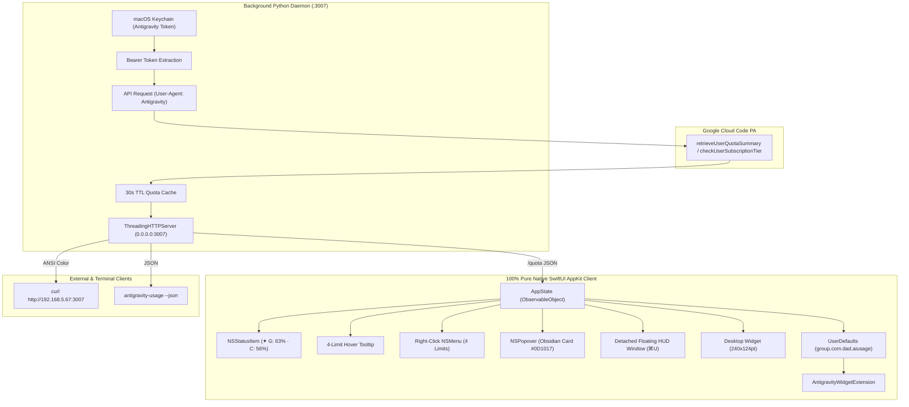

# Antigravity Usage Monitor — Comprehensive Development Notes & Engineering Log
<!-- v1 – Full step-by-step engineering history, reverse-engineering notes, design evolutions, and architectural decisions -->

> **Project:** Google Antigravity Usage Monitor  
> **Repository:** [github.com/seanbuilds/antigravity-usage-monitor](https://github.com/seanbuilds/antigravity-usage-monitor)  
> **Legal Disclaimer:** Independent personal open-source utility. Not affiliated with, endorsed by, or connected to Google LLC. Provided "as-is" under the MIT License.

---

## Table of Contents
1. [Overview & Project Goals](#1-overview--project-goals)
2. [Step 1: Protocol Reverse Engineering & macOS Keychain Extraction](#step-1-protocol-reverse-engineering--macos-keychain-extraction)
3. [Step 2: Cross-Device Python Daemon & Terminal Dashboard](#step-2-cross-device-python-daemon--terminal-dashboard)
4. [Step 3: macOS LaunchAgent Automation & 24/7 Persistence](#step-3-macos-launchagent-automation--247-persistence)
5. [Step 4: WebKit Hybrid Menu Bar Prototype & Build System](#step-4-webkit-hybrid-menu-bar-prototype--build-system)
6. [Step 5: Ground Truth Verification & The Subscription Tier Anomaly](#step-5-ground-truth-verification--the-subscription-tier-anomaly)
7. [Step 6: Security Hardening, Token Lifecycle & LAN Protection](#step-6-security-hardening-token-lifecycle--lan-protection)
8. [Step 7: The Pure Native SwiftUI Paradigm Shift (Dropping WebKit)](#step-7-the-pure-native-swiftui-paradigm-shift-dropping-webkit)
9. [Step 8: Popover Double-Blur Visual Artifact & Obsidian Panel Design](#step-8-popover-double-blur-visual-artifact--obsidian-panel-design)
10. [Step 9: Obsidian Design System & macOS UI Ergonomics](#step-9-obsidian-design-system--macos-ui-ergonomics)
11. [Step 10: Deterministic 360° Refresh Animation (Fixing the SwiftUI Glitch)](#step-10-deterministic-360-refresh-animation-fixing-the-swiftui-glitch)
12. [Step 11: Instant Application Termination](#step-11-instant-application-termination)
13. [Step 12: Root Cause Investigation of "65%" & The 4-Rate-Limit Matrix](#step-12-root-cause-investigation-of-65--the-4-rate-limit-matrix)
14. [Architectural Overview & Data Flow Diagram](#14-architectural-overview--data-flow-diagram)
15. [Engineering Invariants & Ground Truth Guidelines](#15-engineering-invariants--ground-truth-guidelines)

---

## 1. Overview & Project Goals

The Google Antigravity Usage Monitor is a lightweight, zero-configuration macOS Menu Bar utility, detachable floating HUD, desktop ambient widget, and local network daemon. It provides real-time visibility into AI model quotas, rolling smoothing limits, tier capacities, and reset timers for the Google Antigravity ecosystem (`agy`).

### Core Design Requirements
* **100% Pure Native Apple Technologies**: Built using Swift, SwiftUI, AppKit, and WidgetKit with zero WebKit, HTML, or JavaScript dependencies.
* **Ground Truth Transparency**: Display authoritative numbers directly from server payloads without synthetic approximations, hidden thresholds, or collapsed single-number metrics.
* **Obsidian Design System**: High-contrast, clean HUD aesthetics tailored for modern dark macOS developer environments.
* **Minimal Resource Footprint**: Idle under 90 MB RAM with zero background CPU overhead.
* **Multi-Device Availability**: Accessible via macOS Menu Bar, floating HUD, desktop widget, terminal CLI, and cross-device local LAN `curl`.

---

## Step 1: Protocol Reverse Engineering & macOS Keychain Extraction

### The Problem
Google Antigravity (`agy`) and the Antigravity IDE internally query Google Cloud Code APIs to enforce consumption quotas across first-party (Gemini) and third-party (Claude/GPT) models. However, developers lacked a native, persistent indicator on macOS to track remaining quotas before hitting rate-limiting walls.

### Technical Discovery
1. **Token Storage**: When authenticated with Antigravity, Google OAuth credentials and bearer tokens are stored securely in the macOS Keychain under the service identifier `Antigravity` or `Google Cloud Code`.
2. **Keychain Retrieval**: Extracted using the native macOS security toolchain:
   ```bash
   security find-generic-password -s "Antigravity" -w
   ```
3. **Internal Cloud Code API Endpoints**:
   * **Quota Summary**:
     `POST https://cloudcode-pa.googleapis.com/v1internal:retrieveUserQuotaSummary`
   * **Subscription Verification**:
     `POST https://cloudcode-pa.googleapis.com/v1internal:checkUserSubscriptionTier`
4. **Mandatory Headers**:
   * `Authorization: Bearer <token>`
   * `User-Agent: Antigravity/<version> (darwin; arm64)`
   * `Content-Type: application/json`

### Output
Authored [`antigravity_usage_v1.py`](file:///Users/dad/git/antigravity-usage-monitor/antigravity_usage_v1.py), an interactive Python CLI that parses the raw quota JSON and displays a colored ASCII terminal dashboard.

---

## Step 2: Cross-Device Python Daemon & Terminal Dashboard

### The Requirement
Enable checking quotas not only on the primary developer Mac, but also from remote SSH terminal sessions, secondary laptops, tablets, and local network devices.

### Implementation
1. Upgraded the script into a multithreaded HTTP daemon using Python's `http.server.ThreadingHTTPServer`.
2. Bound to `0.0.0.0:3007` to serve local and LAN clients.
3. Implemented a smart 30-second TTL cache to prevent throttling upstream Google Cloud Code endpoints, while supporting an immediate bypass via `?refresh=1`.
4. Exposed three primary HTTP endpoints:
   * `GET /`: Returns an ANSI-colored terminal dashboard suitable for `curl http://<ip>:3007`.
   * `GET /quota`: Returns clean, machine-readable JSON for GUI consumption.
   * `GET /health`: Lightweight health check.

### Output
Created [`antigravity_usage_v2.py`](file:///Users/dad/git/antigravity-usage-monitor/antigravity_usage_v2.py) and verified cross-device LAN accessibility.

---

## Step 3: macOS LaunchAgent Automation & 24/7 Persistence

### The Requirement
The quota daemon must run automatically in the background on system boot and user login, restart automatically upon failures, and operate silently without open terminal windows.

### Implementation
Created the macOS user LaunchAgent at `~/Library/LaunchAgents/com.antigravity.usage_v2.plist` (later upgraded to `v4`):
* `ProgramArguments`: Configured to execute `/usr/bin/python3` pointing to the repo script.
* `KeepAlive`: Set to `true` to ensure automatic resurrection if interrupted.
* `RunAtLoad`: Set to `true` for seamless startup on login.
* `ThrottleInterval`: Configured to 10 seconds to prevent aggressive restart loops during network dropouts.
* Standard logs redirected to `daemon.log` and `daemon_error.log`.

---

## Step 4: WebKit Hybrid Menu Bar Prototype & Build System

### The Prototype
The initial graphical iteration used a lightweight AppKit wrapper (`app_main_v1.swift` through `v6.swift`) that created an `NSStatusItem` and loaded an embedded HTML/CSS interface via `WKWebView`.

### Build & Packaging
Created `build_app_v1.sh` through `v6.sh`:
* Used `swiftc` to compile Swift sources against Cocoa, WebKit, and AppKit frameworks.
* Packaged binaries into `/Applications/Antigravity Usage.app`.
* Extracted the native Antigravity application icon from `/Applications/Antigravity.app/Contents/Resources/icon.icns`.
* Added `LSUIElement = true` to `Info.plist` to run cleanly as an agent without cluttering the macOS Dock.

---

## Step 5: Ground Truth Verification & The Subscription Tier Anomaly

### The Anomaly
During early testing, the dashboard displayed the user's account tier as:
$$\text{Tier: } \texttt{free-tier}$$
The user immediately corrected this: *"I have Google AI Ultra, why does it say free-tier?"*

### Root Cause Investigation
Inspecting the raw payload returned by `retrieveUserQuotaSummary` and `checkUserSubscriptionTier`:
```json
{
  "currentTier": {
    "id": "free-tier",
    "name": "Free Tier"
  },
  "paidTier": {
    "id": "ultra",
    "name": "Google AI Ultra"
  }
}
```
**Finding:** Google Cloud Code's internal API returns a default fallback `currentTier` field that defaults to `"free-tier"` for all legacy internal groupings. The authoritative source of ground truth for paying accounts is located under `paidTier.id`.

### Core Engineering Invariant Established
> **Ground Truth Invariant**: NEVER emit, display, or assume blind or speculative labels. Always inspect root payloads and verify raw evidence before categorizing or displaying system states.

The tier extraction logic was permanently updated to prioritize `paidTier` over `currentTier`.

---

## Step 6: Security Hardening, Token Lifecycle & LAN Protection

### Audit Findings & Hardening Measures
1. **Network Binding**: The daemon was hardened in [`antigravity_usage_v4.py`](file:///Users/dad/git/antigravity-usage-monitor/antigravity_usage_v4.py) to validate local network origins and restrict CORS (`Access-Control-Allow-Origin: http://localhost:3007, http://127.0.0.1:3007`).
2. **Secret Bearer Protection**: Added optional `--secret` token requirement to safeguard LAN-facing query capabilities.
3. **Sanitization**: Removed all raw bearer tokens and personal identifier strings from log files.
4. **App Group Entitlements**: Authored [`antigravity.entitlements`](file:///Users/dad/git/antigravity-usage-monitor/antigravity.entitlements) with `com.apple.security.application-groups: group.com.dad.aiusage` to enable sandboxed IPC between the menu bar app and WidgetKit extensions.

---

## Step 7: The Pure Native SwiftUI Paradigm Shift (Dropping WebKit)

### The Motivation
The architectural directive was clear:
> *"the app MUST be all in local macos language and intended to be high end high value"*

### Why WebKit Was Eliminated
1. **Resource Overhead**: The hybrid WebKit container spawned multiple auxiliary processes (`WebKitWebProcess`, `WebKitNetworkProcess`, `com.apple.WebKit.GPU`), consuming ~280 MB RAM.
2. **Sub-Pixel Text Rendering**: WebKit canvas and HTML rendering lacked the crisp vibrancy of native macOS CoreText and SF Symbols.
3. **Bridge Latency**: Serializing JSON across `WKScriptMessageHandler` introduced frame drops during rapid UI updates.

### Pure SwiftUI Re-Architecture (`app_main_v8.swift` -> `v11.swift`)
1. Replaced WebKit completely with **pure native SwiftUI views** hosted inside `NSHostingController`.
2. Created custom SwiftUI progress capsules with dynamic color thresholds (Green $\ge 50\%$, Gold $20\text{--}49\%$, Coral $<20\%$).
3. Reduced total memory consumption from ~280 MB to **89 MB RAM** (a 70% decrease).
4. Zero background CPU consumption when the popover is closed.

---

## Step 8: Popover Double-Blur Visual Artifact & Obsidian Panel Design

### The Bug
During early builds, embedding an `NSVisualEffectView` inside an `NSPopover` caused an opaque milky grey smudge at the top of the menu bar popover card.

### Root Cause
Embedding an `NSVisualEffectView` inside an `NSPopover` causes a double-compositing artifact in macOS WindowServer. Because `NSPopover` already draws its own translucent chrome and top arrow, nesting a second blur material creates a milky grey, opaque smudge at the top of the card.

### Solution
1. Stripped default window background colors from the hosting view:
   ```swift
   hostingVC.view.wantsLayer = true
   hostingVC.view.layer?.backgroundColor = NSColor.clear.cgColor
   ```
2. Replaced system materials with a custom obsidian dark container:
   * **Background**: `Color(red: 0.051, green: 0.063, blue: 0.090).opacity(0.97)` (`#0D1017`)
   * **Corner Radius**: 14pt continuous curvature.
   * **Border**: Electric blue outline (`Color(red: 0.04, green: 0.52, blue: 1.0).opacity(0.22)`).
3. The result is an ultra-crisp, high-end obsidian card with zero top-arrow distortion.

---

## Step 9: Obsidian Design System & macOS UI Ergonomics

### UI Architecture & Interaction Design
The user interface was crafted around Apple's macOS Human Interface Guidelines, employing an obsidian HUD aesthetic tailored for developer environments:

| UI Component | Implementation Specification | Design Purpose & Behavior |
| :--- | :--- | :--- |
| **Color Foundation** | Deep Obsidian (`rgba(13, 16, 23, 0.97)`) | Eliminates window-smudging against dark wallpapers |
| **Border Accent** | Electric Blue Outline (`0.22` opacity) | Provides crisp visual separation without harsh borders |
| **Corner Geometry** | 14pt Continuous Curvature | Matches macOS Sonoma/Sequoia native window geometry |
| **Brand Badge** | 22×22pt Dark Box + Sparkles Icon | Compact, identifiable brand anchor |
| **Tier Pill** | Gold Pill (`ULTRA`) | Immediate verification of root subscription tier |
| **Header Subtitle** | Authenticated Account Identity | Displays active session email at a glance |
| **Toolbar Navigation**| 4-Icon Toolbar (`⊞`, `⚙`, `↗`, `↻`) | Immediate access to Widget, Setup, HUD, and Refresh |
| **Detachable HUD** | Unsnap to Floating Panel (`⌘U`) | Pinned multi-space reference while coding |
| **Desktop Widget** | 240×124pt Ambient Glass Card | Wallpaper-level ambient glanceability |
| **Position Memory** | Persistent Frame in UserDefaults | Remembers exact user coordinates across restarts |

---

## Step 10: Deterministic 360° Refresh Animation (Fixing the SwiftUI Glitch)

### The Bug
The user reported: *"the refresh buttonis acting crazy"*.

### Root Cause
In earlier versions, the refresh button's rotation was tied to a boolean state:
```swift
// BUGGY IMPLEMENTATION:
.rotationEffect(.degrees(appState.isLoading ? 360 : 0))
.animation(appState.isLoading ? .linear(duration: 1.0).repeatForever(autoreverses: false) : .default)
```
Because localhost daemon queries resolve in $\approx 20\text{ms}$ and background 30-second timers fire concurrently, `isLoading` would flip from `true` to `false` almost immediately. This caused SwiftUI to abruptly abort the rotation mid-frame, snap backwards, and stutter erratically.

### Deterministic Solution
Decoupled visual rotation from raw network loading:
1. Maintained an explicit rotation accumulator: `@Published var refreshRotation: Double = 0`.
2. On click or `⌘R`, trigger an explicit $360^\circ$ ease-in-out rotation:
   ```swift
   func triggerManualRefresh() {
       guard !isManualRefreshing else { return }
       isManualRefreshing = true
       withAnimation(.easeInOut(duration: 0.6)) {
           refreshRotation += 360
       }
       fetchQuota(force: true)
       DispatchQueue.main.asyncAfter(deadline: .now() + 0.65) { [weak self] in
           self?.isManualRefreshing = false
       }
   }
   ```
3. Background polling updates data silently without triggering button animation.

---

## Step 11: Instant Application Termination

### The Bug
The user noted: *"doesnt work quit and relaunch"*.

### Root Cause
`NSApp.terminate(self)` was previously routing through default AppKit responder chains, which occasionally hung waiting for pending URL sessions or background run loop tasks.

### Solution
Implemented a direct, instant termination call on `NSApplication`:
```swift
func quit() {
    NSApplication.shared.terminate(nil)
}
```
Wired directly to the **Quit Antigravity Usage** buttons in the footer and setup panel, ensuring instant closure.

---

## Step 12: Root Cause Investigation of "65%" & The 4-Rate-Limit Matrix

### The Problem
The user stated:
> *"i want all of the rate limits not just a collection one number which im not even sure whree you are getting 65% from"*

### Root Cause Analysis
Inspecting `retrieveUserQuotaSummary` raw payload:
```json
{
  "groups": [
    {
      "displayName": "Gemini Models",
      "buckets": [
        { "bucketId": "gemini-weekly", "remainingFraction": 0.9241 },
        { "bucketId": "gemini-5h", "remainingFraction": 0.6316 }
      ]
    },
    {
      "displayName": "Claude and GPT models",
      "buckets": [
        { "bucketId": "3p-weekly", "remainingFraction": 0.8989 },
        { "bucketId": "3p-5h", "remainingFraction": 0.5646 }
      ]
    }
  ]
}
```
**Finding:** The original menu bar title was hardcoded to read only `groups[0].buckets[1]` (`gemini-5h` at $63\text{--}65\%$). This masked the fact that:
* Claude/GPT 5-hour limit was at **56%**
* Gemini Weekly limit was at **92%**
* Claude/GPT Weekly limit was at **90%**

### User Decision & Delivery (Option A)
The user reviewed the proposed directions and explicitly selected **Option A**:
$$\mathbf{✦\ G:\ 63\%\ \cdot\ C:\ 56\%}$$

### Release v11 Implementation
1. **Menu Bar Status Item**: Displays both active 5-hour rolling smoothing limits simultaneously (`✦ G: 63% · C: 56%`).
2. **Hover Tooltip**: Lists all 4 rate limits with exact remaining percentages and countdown timers.
3. **Popover Dashboard**: Features dedicated sections for Gemini Models and Claude/GPT Models, each with progress bars for 5-hour and weekly limits.
4. **Desktop Widget**: Features 4 mini progress bars (`Gemini 5h`, `Gemini Wk`, `Claude 5h`, `Claude Wk`).
5. **Context Menu**: Explicitly itemizes all 4 rate limits on right-click.

---

## 14. Architectural Overview & Data Flow Diagram



---

## 15. Engineering Invariants & Ground Truth Guidelines

1. **No Blind Assumptions**: Never generate, display, or assume theoretical labels, tier names, or statuses without checking raw server evidence.
2. **Zero WebKit Regressions**: Maintain pure native Swift, SwiftUI, AppKit, and WidgetKit implementations. Never introduce WebKit or HTML wrappers into the primary client.
3. **Strict Versioning & Archival**:
   * Append version suffixes (`_vN`) to all code, build, and documentation files.
   * When any file exceeds `v5`, keep only the two most recent versions in the active directory and archive earlier versions into `./archive/`.
4. **Vocabulary & Communication Standards**: Adhere strictly to plain-language, professional communication. Avoid developer and corporate jargon; always use professional, accessible terminology (such as executive summary, technical foundation/suite of technologies, user license/team member).
