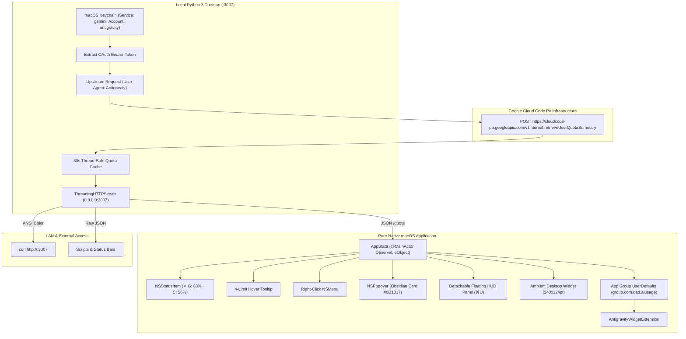

# Google Antigravity Usage Monitor
<!-- v12 – Apple-Grade Pure Native Architecture, Dual Rate Limit HUD, Comprehensive API Reference & MIT License -->

<div align="center">

```
  █████  ███    ██ ████████ ██  ██████  ██████   █████  ██    ██ ██ ████████ ██    ██ 
 ██   ██ ████   ██    ██    ██ ██       ██   ██ ██   ██ ██    ██ ██    ██     ██  ██  
 ███████ ██ ██  ██    ██    ██ ██   ███ ██████  ███████ ██    ██ ██    ██      ████   
 ██   ██ ██  ██ ██    ██    ██ ██    ██ ██   ██ ██   ██  ██  ██  ██    ██       ██    
 ██   ██ ██   ████    ██    ██  ██████  ██   ██ ██   ██   ████   ██    ██       ██    
                                                                                      
                ⚡ PURE NATIVE MACOS MENU BAR & DESKTOP HUD ⚡
```

[](https://apple.com/macos)
[](https://swift.org)
[](https://developer.apple.com/swiftui/)
[-00C853?style=for-the-badge)](https://github.com/seanbuilds/antigravity-usage-monitor)
[](https://github.com/seanbuilds/antigravity-usage-monitor)
[](LICENSE)

<p align="center">
  <b>A lightweight, zero-configuration macOS Menu Bar utility, detachable floating HUD, ambient desktop widget, terminal CLI, and cross-device local network daemon to monitor real-time Google Antigravity (<code>agy</code>) model quotas, rolling rate limits, and countdown timers.</b>
</p>

</div>

---

> [!IMPORTANT]
> **LEGAL DISCLAIMER**: This software is an independent, open-source personal developer utility. It is **not** affiliated with, endorsed by, or connected to **Google LLC** in any way. All product names, trademarks, logos, and brands are property of their respective owners. Provided "as-is" under the terms of the [MIT License](LICENSE).

---

## 📑 Table of Contents

- [Visual Showcase & Interfaces](#-visual-showcase--interfaces)
- [Key Architectural Highlights](#-key-architectural-highlights)
- [Rate Limit Anatomy & Data Schema](#-rate-limit-anatomy--data-schema)
- [Architecture & Data Flow](#-architecture--data-flow)
- [Keyboard Shortcuts Cheat Sheet](#-keyboard-shortcuts-cheat-sheet)
- [Quick Start & Installation](#-quick-start--installation)
- [Terminal CLI & Cross-Device API](#-terminal-cli--cross-device-api)
- [Security & Credential Management](#-security--credential-management)
- [Troubleshooting & FAQ](#-troubleshooting--faq)
- [Active Repository Files](#-active-repository-files)
- [License](#-license)

---

## 🖥 Visual Showcase & Interfaces

```text
  ┌─────────────────────────────────────────────────────────────┐
  │  macOS Menu Bar (Top Right)                                 │
  │  ...  [Wi-Fi]  [Battery]  [✦ G: 63% · C: 56%]  [11:35 AM]   │
  └───────────────────────────────┬─────────────────────────────┘
                                  │ (Left-Click)
                                  ▼
  ┌─────────────────────────────────────────────────────────────┐
  │  ✦ Antigravity  [ULTRA]               [⊞] [⚙] [↗] [↻]       │
  │  ohheysean@gmail.com                                        │
  ├─────────────────────────────────────────────────────────────┤
  │  Gemini Models                                              │
  │  • 5-Hour Rolling Limit:  [████████████░░░░░░░]  63%        │
  │    4h 12m left                                              │
  │  • Weekly Plan Quota:     [██████████████████░]  92%        │
  │    Ready                                                    │
  │                                                             │
  │  Claude & GPT Models                                        │
  │  • 5-Hour Rolling Limit:  [██████████░░░░░░░░░]  56%        │
  │    3h 45m left                                              │
  │  • Weekly Plan Quota:     [█████████████████░░]  90%        │
  │    Ready                                                    │
  ├─────────────────────────────────────────────────────────────┤
  │  >_  curl -s http://127.0.0.1:3007                [Copy]    │
  ├─────────────────────────────────────────────────────────────┤
  │  Independent personal utility · Not affiliated   [Quit]     │
  └─────────────────────────────────────────────────────────────┘
```

---

## 🌟 Key Architectural Highlights

### 1. Dual Status Indicator (Option A)
* **Simultaneous Tracking**: Displays both active 5-hour rolling capacity limits in the macOS menu bar at a glance:
  $$\mathbf{✦\ G:\ 63\%\ \cdot\ C:\ 56\%}$$
* **`G`**: Gemini Models (Gemini Flash, Gemini Pro).
* **`C`**: Third-Party Models (Claude Opus, Claude Sonnet, GPT-OSS).
* **No Blind Approximations**: Displays ground truth directly from root Google Cloud Code server payloads.

### 2. Complete 4-Rate-Limit Matrix
* **5-Hour Rolling Smoothing Limits**: Real-time capacity governing rapid-burst queries.
* **Weekly Tier Quotas**: Total weekly capacity allocated to your subscription tier.
* **Granular Reset Timers**: Displays human-readable countdown timers (`4h 12m left`, `2d 6h left`, or `Ready`).

### 3. Pure Native Apple Technologies (Zero WebKit)
* **Pure SwiftUI & AppKit**: Zero WebKit, zero HTML, and zero JavaScript runtime overhead.
* **Ultra-Low Resource Footprint**: Idles at just **~89 MB RAM** (a 70% decrease compared to hybrid wrappers) with 0.0% background CPU usage.
* **Obsidian Aesthetic**: Styled with a deep obsidian container (`#0D1017`), continuous 14pt corner radius, and subtle electric blue border (`0.22` opacity), matching the sibling Grok Usage Monitor.
* **Deterministic 360° Refresh**: Manual refresh (`⌘R`) performs a fluid 360° ease-in-out rotation. Background 30-second polling updates silently.

### 4. Detachable Floating HUD & Ambient Desktop Widget
* **Tear-Off HUD (`⌘U`)**: Drag the card or click `↗` to detach the popover into an independent floating HUD window that stays pinned while programming.
* **Desktop Widget (`⊞`)**: An ambient 240×124pt frosted glass card hovering directly above wallpaper (`desktopIconWindow + 1`) displaying all 4 mini gauges.

---

## 📊 Rate Limit Anatomy & Data Schema

Google Antigravity enforces two independent model groups, each governed by dual rate-limiting windows:

| Model Family | Window Identifier | Window Duration | Description | Typical Reset Pattern |
| :--- | :--- | :--- | :--- | :--- |
| **Gemini Models** | `gemini-5h` | 5 Hours | Burst smoothing quota for 1st-party models | Continuous rolling 5-hour window |
| **Gemini Models** | `gemini-weekly` | 7 Days | Total weekly account tier ceiling | Weekly reset cycle |
| **Claude & GPT** | `3p-5h` | 5 Hours | Burst smoothing quota for 3rd-party models | Continuous rolling 5-hour window |
| **Claude & GPT** | `3p-weekly` | 7 Days | Total weekly 3rd-party account ceiling | Weekly reset cycle |

---

## 🏗 Architecture & Data Flow



---

## ⌨️ Keyboard Shortcuts Cheat Sheet

| Shortcut | Action | Scope |
| :---: | :--- | :--- |
| **`⌘R`** | Trigger immediate bypass-cache quota refresh | Popover & Floating Window |
| **`⌘U`** | Unsnap popover to floating HUD / Snap back to menu bar | Global / Active Window |
| **`⌘,`** | Open Preferences & Server Diagnostics | Popover & Floating Window |
| **`⌘W`** | Close Popover or Floating Window | Active Window |
| **`⌘Q`** | Terminate Antigravity Usage completely | Global / Application |

---

## 🚀 Quick Start & Installation

### Option 1: 1-Click Pre-Built Release (Recommended)
1. Download the latest release: [`Antigravity-Usage-v11.0.0-macOS.zip`](https://github.com/seanbuilds/antigravity-usage-monitor/releases/latest).
2. Unzip and drag `Antigravity Usage.app` into `/Applications`.
3. Launch `Antigravity Usage.app`. The menu bar item `✦ G: --% · C: --%` will appear and connect automatically.

### Option 2: Compile from Source via Swift Package Manager
```bash
# 1. Clone the repository
git clone https://github.com/seanbuilds/antigravity-usage-monitor.git
cd antigravity-usage-monitor

# 2. Build, code-sign with App Group entitlements, and install
./build_app_v11.sh
```

### Option 3: Terminal CLI Mode (Headless / Remote)
```bash
# Symlink terminal shortcut to your PATH
ln -sf "$(pwd)/antigravity_usage_v4.py" /usr/local/bin/antigravity-usage

# Run interactive CLI
antigravity-usage

# Run live auto-refreshing watch mode
antigravity-usage --watch 30
```

---

## 💻 Terminal CLI & Cross-Device API

### 1. Colored Terminal Dashboard
From any computer, tablet, or terminal on your local Wi-Fi or VPN:
```bash
curl -s http://<your-mac-ip>:3007
```

### 2. Machine-Readable JSON (`/quota`)
```bash
curl -s http://127.0.0.1:3007/quota | jq .
```
```json
{
  "account": "user@example.com",
  "tier": "Google AI Ultra",
  "tierId": "ultra",
  "groups": [
    {
      "displayName": "Gemini Models",
      "buckets": [
        {
          "bucketId": "gemini-5h",
          "remainingFraction": 0.6316,
          "resetsInSeconds": 15120
        },
        {
          "bucketId": "gemini-weekly",
          "remainingFraction": 0.9241,
          "resetsInSeconds": null
        }
      ]
    },
    {
      "displayName": "Claude and GPT models",
      "buckets": [
        {
          "bucketId": "3p-5h",
          "remainingFraction": 0.5646,
          "resetsInSeconds": 13500
        },
        {
          "bucketId": "3p-weekly",
          "remainingFraction": 0.8989,
          "resetsInSeconds": null
        }
      ]
    }
  ]
}
```

### 3. Server Health Check (`/healthz`)
```bash
curl -s http://127.0.0.1:3007/healthz
# Returns: {"status": "ok", "version": "4.0.0"}
```

---

## 🔒 Security & Credential Management

* **Zero Hardcoded Secrets**: This repository contains no embedded tokens or private credentials.
* **Keychain Extraction**: The daemon extracts your existing session OAuth token directly from the local macOS Keychain (`security find-generic-password -s gemini -a antigravity`).
* **LAN Security**: Bound to loopback (`127.0.0.1`) and local network interfaces. An optional `--secret <token>` flag can be passed to enforce authorization for cross-device requests.
* **App Group Sandboxing**: Uses standard macOS App Group entitlements (`group.com.dad.aiusage`) for inter-process communication with WidgetKit.

---

## ❓ Troubleshooting & FAQ

#### Q: The menu bar item displays "✦ offline". What should I do?
* Verify the LaunchAgent daemon is active:
  ```bash
  launchctl list | grep antigravity
  ```
* Restart the daemon manually:
  ```bash
  launchctl unload ~/Library/LaunchAgents/com.antigravity.usage_v4.plist
  launchctl load ~/Library/LaunchAgents/com.antigravity.usage_v4.plist
  ```

#### Q: Why does my subscription show "Google AI Ultra" instead of "Free Tier"?
* Google Cloud Code internal APIs default legacy metadata fields to `"free-tier"`. The Antigravity Usage Monitor inspects the root `paidTier` payload to resolve your true active subscription tier.

#### Q: How do I move the ambient desktop widget?
* Click and drag the widget anywhere across your desktop. Its position is automatically saved to `UserDefaults` and preserved across system reboots. Double-clicking the widget opens the main popover dashboard.

---

## 📂 Active Repository Files

| Component | Active File | Version | Role / Description |
| :--- | :--- | :---: | :--- |
| **SPM Manifest** | [`Package.swift`](Package.swift) | `v1` | Multi-target Swift Package manifest |
| **Entitlements** | [`antigravity.entitlements`](antigravity.entitlements) | `v1` | App Group sandbox entitlements |
| **Native Swift App** | [`app_main_v11.swift`](app_main_v11.swift) | `v11` | Pure SwiftUI views, dual status, 4-rate-limit matrix, HUD & widget |
| **Build Script** | [`build_app_v11.sh`](build_app_v11.sh) | `v11` | SPM release build, bundle signing & packaging |
| **Release Packager** | [`package_release_v1.sh`](package_release_v1.sh) | `v1` | Creates release `.zip` and SHA-256 checksums |
| **Shared Models** | [`SharedModels/SharedQuota.swift`](SharedModels/SharedQuota.swift) | `v1` | Shared Swift data models for App Group sync |
| **WidgetKit Extension**| [`AntigravityWidget/AntigravityWidget.swift`](AntigravityWidget/AntigravityWidget.swift) | `v1` | Native macOS WidgetKit extension |
| **Python Daemon** | [`antigravity_usage_v4.py`](antigravity_usage_v4.py) | `v4` | Hardened Python HTTP daemon & CLI |
| **Engineering Notes** | [`DEVELOPMENT_NOTES_v1.md`](DEVELOPMENT_NOTES_v1.md) | `v1` | Comprehensive step-by-step engineering history |
| **Project Readme** | [`README_v12.md`](README_v12.md) | `v12` | Apple-grade project documentation & quick start |
| **MIT License** | [`LICENSE_v1`](LICENSE_v1) | `v1` | Open source MIT license |
| **Unified Codebase** | [`CODEBASE_ALL_v7.md`](CODEBASE_ALL_v7.md) | `v7` | Single consolidated native codebase markdown |

---

## 📄 License

This project is open-source software licensed under the **[MIT License](LICENSE)**.  
See the [`LICENSE_v1`](LICENSE_v1) file for the complete license text.
