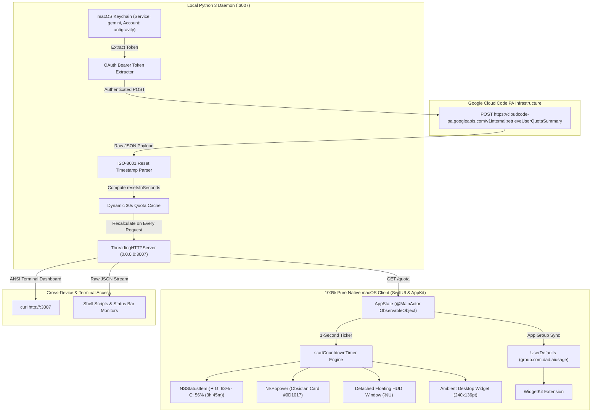

# Google Antigravity Usage Monitor
<!-- v13 – High-Contrast Architecture Diagram, Dual Rate-Limit Architecture (Gemini & Claude/GPT 5h + Weekly), Live Countdown Timers, Keyboard Shortcuts & Pure Native Swift 12.0.0 -->

<div align="center">

```
  █████  ███    ██ ████████ ██  ██████  ██████   █████  ██    ██ ██ ████████ ██    ██ 
 ██   ██ ████   ██    ██    ██ ██       ██   ██ ██   ██ ██    ██ ██    ██     ██  ██  
 ███████ ██ ██  ██    ██    ██ ██   ███ ██████  ███████ ██    ██ ██    ██      ████   
 ██   ██ ██  ██ ██    ██    ██ ██    ██ ██   ██ ██   ██  ██  ██  ██    ██       ██    
 ██   ██ ██   ████    ██    ██  ██████  ██   ██ ██   ██   ████   ██    ██       ██    
                                                                                      
                ⚡ PURE NATIVE MACOS MENU BAR & DESKTOP HUD ⚡
```

[](https://apple.com/macos)
[](https://swift.org)
[](https://developer.apple.com/swiftui/)
[-00C853?style=for-the-badge)](https://github.com/seanbuilds/antigravity-usage-monitor)
[](https://github.com/seanbuilds/antigravity-usage-monitor)
[](LICENSE)

<p align="center">
  <b>A lightweight, zero-configuration macOS Menu Bar utility, detachable floating HUD, ambient desktop widget, terminal CLI, and cross-device local network daemon to monitor real-time Google Antigravity (<code>agy</code>) model quotas, rolling rate limits, and live countdown timers.</b>
</p>

</div>

---

> [!IMPORTANT]
> **LEGAL DISCLAIMER**: This software is an independent, open-source personal developer utility. It is **not** affiliated with, endorsed by, or connected to **Google LLC** in any way. All product names, trademarks, logos, and brands are property of their respective owners. Provided "as-is" under the terms of the [MIT License](LICENSE).

---

## 📑 Table of Contents

- [Visual Showcase & User Interfaces](#-visual-showcase--user-interfaces)
- [Dual Rate-Limit Architecture (4-Limit Matrix)](#-dual-rate-limit-architecture-4-limit-matrix)
- [Live Countdown Timers & ISO-8601 Engine](#-live-countdown-timers--iso-8601-engine)
- [System Architecture & Data Flow](#-system-architecture--data-flow)
- [Keyboard Shortcuts Cheat Sheet](#-keyboard-shortcuts-cheat-sheet)
- [Installation & Quick Start](#-installation--quick-start)
- [Terminal CLI & Cross-Device API](#-terminal-cli--cross-device-api)
- [Security & Credential Management](#-security--credential-management)
- [Troubleshooting & FAQ](#-troubleshooting--faq)
- [Active Repository Files](#-active-repository-files)
- [License](#-license)

---

## 🖥 Visual Showcase & User Interfaces

```text
  ┌────────────────────────────────────────────────────────────────────────┐
  │  macOS Menu Bar (Top Right Status Item)                                │
  │  ...  [Wi-Fi]  [Battery]  [✦ G: 63% · C: 56% (3h 45m)]  [11:35 AM]     │
  └───────────────────────────────────┬────────────────────────────────────┘
                                      │ (Left-Click or ⌘U)
                                      ▼
  ┌────────────────────────────────────────────────────────────────────────┐
  │  ✦ Antigravity  [ULTRA]                                [⊞] [⚙] [↗] [↻] │
  │  ohheysean@gmail.com                                                   │
  ├────────────────────────────────────────────────────────────────────────┤
  │  Gemini Models                                                         │
  │  • 5-Hour Rolling Limit:     [████████████░░░░░░░]  63%                │
  │    [resets in 4h 12m]                                                  │
  │  • Weekly Plan Quota:        [██████████████████░]  92%                │
  │    [Ready]                                                             │
  │                                                                        │
  │  Claude & GPT Models                                                   │
  │  • 5-Hour Rolling Limit:     [██████████░░░░░░░░░]  56%                │
  │    [resets in 3h 45m]                                                  │
  │  • Weekly Plan Quota:        [█████████████████░░]  90%                │
  │    [Ready]                                                             │
  ├────────────────────────────────────────────────────────────────────────┤
  │  >_  curl -s http://127.0.0.1:3007                           [Copy]    │
  ├────────────────────────────────────────────────────────────────────────┤
  │  Independent personal utility · Not affiliated              [Quit]     │
  └────────────────────────────────────────────────────────────────────────┘
```

---

## 📊 Dual Rate-Limit Architecture (4-Limit Matrix)

Google Antigravity enforces independent consumption ceilings for first-party (Gemini) and third-party partner models (Claude, GPT). Each model family is governed by two concurrent windows: a **5-Hour Rolling Smoothing Limit** for burst pacing, and a **Weekly Plan Quota** for aggregate capacity.

```
┌───────────────────────────────────────────────────────────────────────────────────────┐
│                           ANTIGRAVITY DUAL RATE-LIMIT MATRIX                          │
├───────────────────────────────┬───────────────────────────────┬───────────────────────┤
│ Model Family                  │ 5-Hour Rolling Smoothing      │ Weekly Plan Quota     │
├───────────────────────────────┼───────────────────────────────┼───────────────────────┤
│ Gemini Models                 │ gemini-5h                     │ gemini-weekly         │
│ (Gemini 2.5 Flash, Pro)       │ Window: 5 Hours (Rolling)     │ Window: 7 Days (Plan) │
│                               │ Purpose: Burst Smoothing      │ Purpose: Tier Ceiling │
├───────────────────────────────┼───────────────────────────────┼───────────────────────┤
│ Claude & GPT Models           │ 3p-5h                         │ 3p-weekly             │
│ (Claude Sonnet/Opus, GPT-OSS) │ Window: 5 Hours (Rolling)     │ Window: 7 Days (Plan) │
│                               │ Purpose: Burst Smoothing      │ Purpose: Tier Ceiling │
└───────────────────────────────┴───────────────────────────────┴───────────────────────┘
```

### Why Tracking Both Dimensions Is Crucial
1. **Burst Smoothing (5-Hour Window)**: Prevents short-term request surges from overwhelming model inference servers. Even when your weekly plan quota is 95% full, heavy coding sessions can deplete the 5-hour smoothing window.
2. **Weekly Allocation (7-Day Window)**: Represents your subscription tier's aggregate weekly query entitlement. Depleting the weekly quota locks requests until the next weekly reset cycle.
3. **Dual Status Presentation**: The menu bar presents ground truth for both active smoothing windows (`✦ G: 63% · C: 56%`), ensuring you always know remaining burst capacity for both model families simultaneously.

---

## ⏱ Live Countdown Timers & ISO-8601 Engine

The server returns exact UTC timestamps marking the end of rate-limiting windows. The Antigravity Usage Monitor provides dynamic countdown tracking across all UI surfaces:

### 1. Multi-Surface Countdown Visibility
* **Menu Bar Status Title**: Displays the earliest expiring 5-hour rolling reset in parentheses:
  $$\mathbf{✦\ G:\ 63\%\ \cdot\ C:\ 56\%\ (3h\ 45m)}$$
* **Obsidian Popover & Detachable HUD**: Features glowing electric cyan capsule badges (`[resets in 4h 12m]`, `[resets in 15m]`, or `[Ready]`) rendered adjacent to each rate limit.
* **Hover Tooltip**: Inspects all 4 buckets with exact percentages and granular countdown strings.
* **Right-Click Context Menu**: Instant native menu access detailing each limit and time remaining.

### 2. Live 1-Second Dynamic Engine
* **Local Python Daemon (`antigravity_usage_v5.py`)**: Dynamically computes `resetsInSeconds` on every single request from raw ISO-8601 timestamps (`resetTime`/`resetAt`), guaranteeing that cached responses never freeze countdown timers.
* **Native Swift Engine (`app_main_v12.swift`)**: Employs a dedicated 1-second background timer (`startCountdownTimer()`) that decrements cached seconds in memory and updates the UI smoothly without triggering redundant network calls.
* **Defense-in-Depth Parsing**: Swift inspects both `resetsInSeconds` and raw ISO-8601 strings (handling fractional seconds and standard formats) to ensure resilient time calculation under all network conditions.

---

## 🏗 System Architecture & Data Flow



---

## ⌨️ Keyboard Shortcuts Cheat Sheet

The application supports responsive global and window-scoped keyboard shortcuts designed for developer ergonomics:

| Shortcut | Action | Scope | Description |
| :---: | :--- | :--- | :--- |
| **`⌘R`** | **Manual Refresh** | Popover & Floating HUD | Triggers an immediate network fetch, bypassing cache with a fluid 360° rotation. |
| **`⌘U`** | **Unsnap / Snap HUD** | Global / Menu Bar App | Detaches popover into an independent floating HUD window or snaps back to menu bar. |
| **`⌘W`** | **Close Window** | Active Window | Closes the open popover or hides the detached floating HUD panel. |
| **`⌘,`** | **Diagnostics / Setup** | Popover & Floating HUD | Toggles the diagnostic configuration view displaying daemon health and endpoints. |
| **`⌘Q`** | **Quit Application** | Application-Wide | Instantly terminates the Antigravity Usage Monitor and closes all windows. |

---

## 🚀 Installation & Quick Start

### Option 1: 1-Click Pre-Built Release (Recommended)
1. Download the latest release: [`Antigravity-Usage-v12.0.0-macOS.zip`](https://github.com/seanbuilds/antigravity-usage-monitor/releases/latest).
2. Unzip the archive and drag `Antigravity Usage.app` into your `/Applications` folder.
3. Launch `Antigravity Usage.app`. The menu bar item `✦ G: --% · C: --%` will appear and connect automatically to your local quota daemon.

### Option 2: Compile from Source via Swift Package Manager
```bash
# 1. Clone the repository
git clone https://github.com/seanbuilds/antigravity-usage-monitor.git
cd antigravity-usage-monitor

# 2. Build release binary, code-sign with App Group entitlements, and install
./build_app_v12.sh

# 3. (Optional) Create distributable release zip
./package_release_v2.sh
```

### Option 3: Terminal CLI Mode (Headless / Remote)
```bash
# Create symlink in your PATH
ln -sf "$(pwd)/antigravity_usage_v5.py" /usr/local/bin/antigravity-usage

# Run interactive terminal dashboard
antigravity-usage

# Run live auto-refreshing watch mode
antigravity-usage --watch 30
```

---

## 💻 Terminal CLI & Cross-Device API

### 1. Formatted Terminal Dashboard
Query your quotas from any terminal, remote SSH session, or secondary device on your local network:
```bash
curl -s http://<your-mac-ip>:3007
```

### 2. Machine-Readable JSON (`/quota`)
```bash
curl -s http://127.0.0.1:3007/quota | jq .
```
```json
{
  "account": "ohheysean@gmail.com",
  "tier": "Google AI Ultra",
  "tierId": "ultra",
  "groups": [
    {
      "displayName": "Gemini Models",
      "buckets": [
        {
          "bucketId": "gemini-5h",
          "remainingFraction": 0.6316,
          "resetsInSeconds": 15120,
          "resetTime": "2026-09-14T19:47:14Z"
        },
        {
          "bucketId": "gemini-weekly",
          "remainingFraction": 0.9241,
          "resetsInSeconds": null,
          "resetTime": null
        }
      ]
    },
    {
      "displayName": "Claude and GPT models",
      "buckets": [
        {
          "bucketId": "3p-5h",
          "remainingFraction": 0.5646,
          "resetsInSeconds": 13500,
          "resetTime": "2026-09-14T19:20:14Z"
        },
        {
          "bucketId": "3p-weekly",
          "remainingFraction": 0.8989,
          "resetsInSeconds": null,
          "resetTime": null
        }
      ]
    }
  ]
}
```

### 3. Server Health Check (`/healthz`)
```bash
curl -s http://127.0.0.1:3007/healthz
# Returns: {"status": "ok", "version": "5.0.0"}
```

---

## 🔒 Security & Credential Management

* **Zero Hardcoded Secrets**: This repository contains no embedded tokens, cookies, or private credentials.
* **Native Keychain Extraction**: The daemon retrieves your active OAuth session token directly from the local macOS Keychain (`security find-generic-password -s gemini -a antigravity`).
* **Local Network Guarding**: Defaults to loopback (`127.0.0.1`) and local LAN subnet. Cross-device access can be secured using an optional `--secret <token>` flag.
* **App Group Sandboxing**: Configured with `group.com.dad.aiusage` entitlements to facilitate secure, sandboxed IPC between the menu bar client and WidgetKit extensions.

---

## ❓ Troubleshooting & FAQ

#### Q: The menu bar item displays "✦ offline". What should I check?
* Verify that the LaunchAgent daemon is currently running:
  ```bash
  launchctl list | grep antigravity
  ```
* Restart the background daemon:
  ```bash
  launchctl unload ~/Library/LaunchAgents/com.antigravity.usage_v4.plist
  launchctl load ~/Library/LaunchAgents/com.antigravity.usage_v4.plist
  ```

#### Q: Why does my subscription show "Google AI Ultra" instead of "Free Tier"?
* Google Cloud Code internal APIs return a fallback `currentTier` field that defaults to `"free-tier"`. The Antigravity Usage Monitor inspects the root `paidTier` object to resolve your true active subscription status.

#### Q: How do I reposition the desktop widget?
* Click and drag the ambient widget to any location on your desktop. Its coordinates are automatically persisted in `UserDefaults` and preserved across application relaunches and system reboots.

#### Q: How does the floating HUD interact with multiple displays?
* The detached HUD dynamically detects the active display containing the menu bar item, clamping window coordinates within visible display bounds to prevent clipping or accidental jumping across secondary monitors.

---

## 📂 Active Repository Files

| Component | Active File | Version | Role / Description |
| :--- | :--- | :---: | :--- |
| **Project Readme** | [`README_v13.md`](README_v13.md) | `v13` | Authoritative documentation, architecture diagrams & user guide |
| **Engineering Notes** | [`DEVELOPMENT_NOTES_v2.md`](DEVELOPMENT_NOTES_v2.md) | `v2` | Technical resolution history, ISO-8601 parsing & architecture log |
| **Unified Codebase** | [`CODEBASE_ALL_v9.md`](CODEBASE_ALL_v9.md) | `v9` | Single consolidated codebase markdown document |
| **Native Swift App** | [`app_main_v12.swift`](app_main_v12.swift) | `v12` | Pure SwiftUI views, dual status, live countdowns, HUD & widget |
| **Build Script** | [`build_app_v12.sh`](build_app_v12.sh) | `v12` | SPM release compilation, bundle signing & installation |
| **Release Packager** | [`package_release_v2.sh`](package_release_v2.sh) | `v2` | Distribution archive packager and checksum generator |
| **Python Daemon** | [`antigravity_usage_v5.py`](antigravity_usage_v5.py) | `v5` | Quota daemon with real-time ISO-8601 bucket calculation |
| **SPM Manifest** | [`Package.swift`](Package.swift) | `v1` | Multi-target Swift Package manifest |
| **Entitlements** | [`antigravity.entitlements`](antigravity.entitlements) | `v1` | App Group sandbox entitlements |
| **Shared Models** | [`SharedModels/SharedQuota.swift`](SharedModels/SharedQuota.swift) | `v1` | Cross-process Swift data models for App Group sync |
| **WidgetKit Extension**| [`AntigravityWidget/AntigravityWidget.swift`](AntigravityWidget/AntigravityWidget.swift) | `v1` | Native macOS WidgetKit extension |
| **MIT License** | [`LICENSE_v1`](LICENSE_v1) | `v1` | Complete MIT open-source license |

---

## 📄 License

This project is open-source software licensed under the **[MIT License](LICENSE)**.  
See the [`LICENSE_v1`](LICENSE_v1) file for the full license text.
